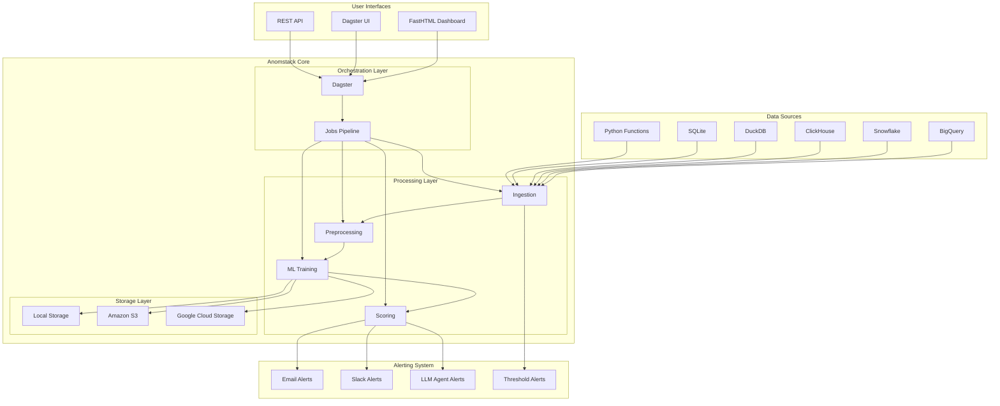
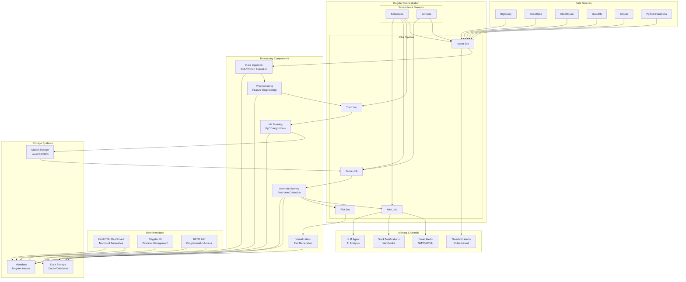
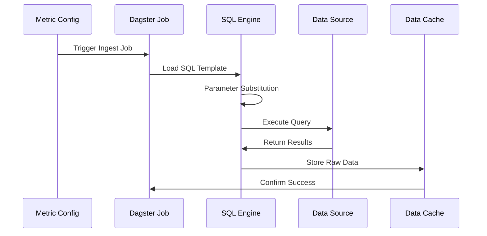
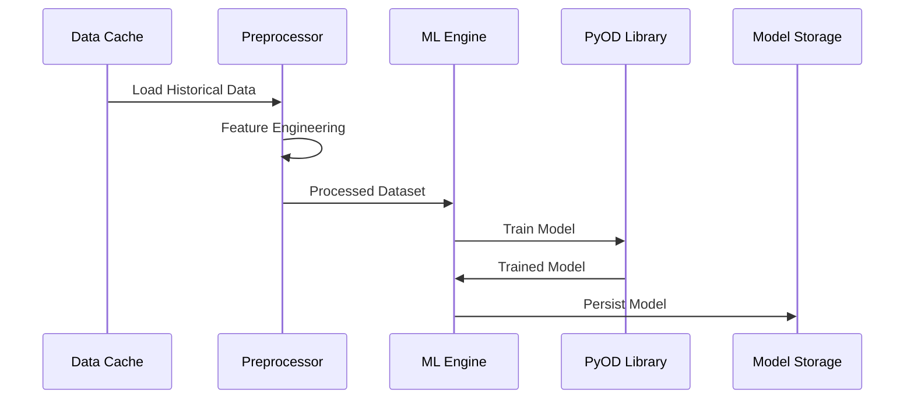
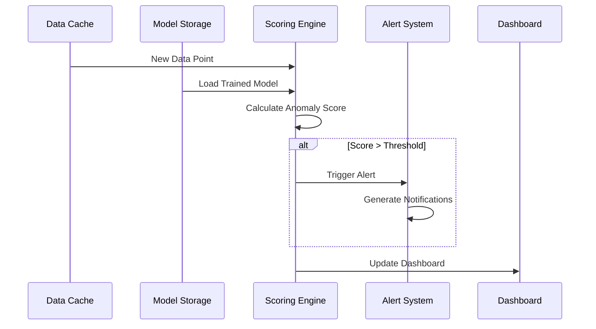
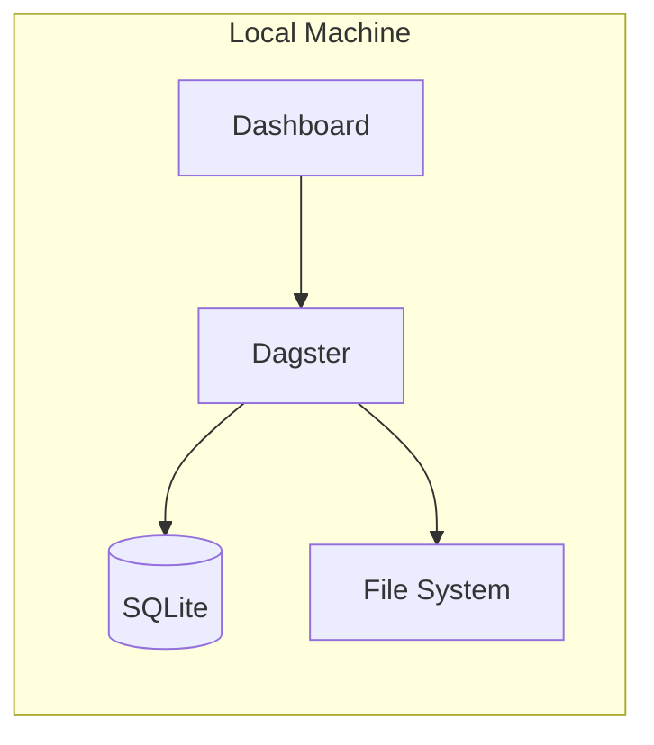
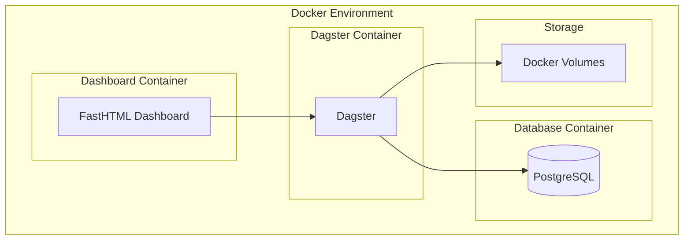
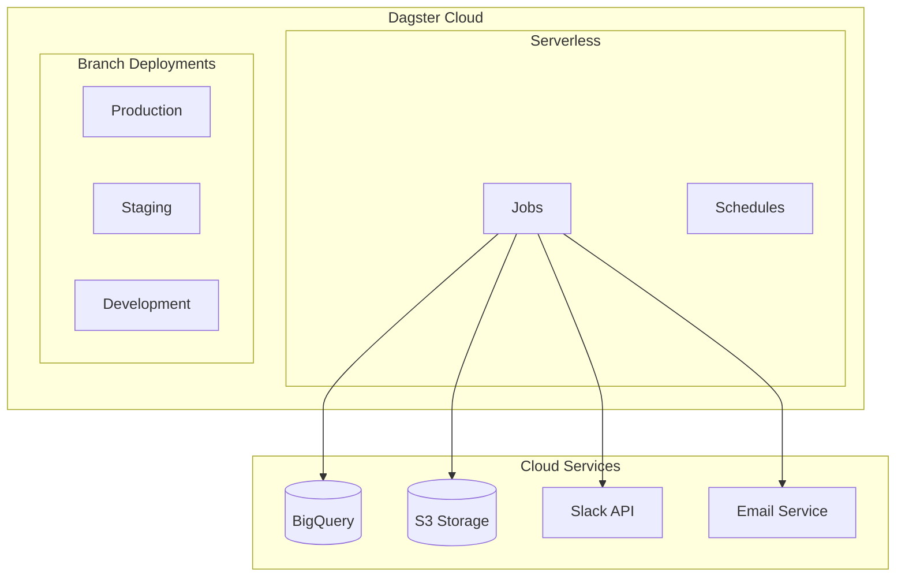
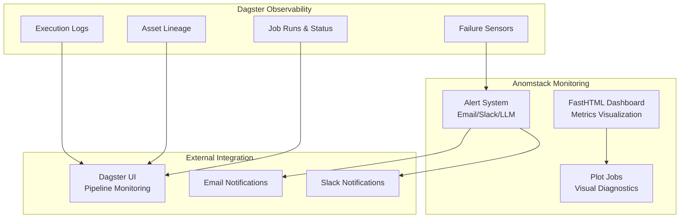

# Anomstack Architecture

This document provides a comprehensive overview of Anomstack's architecture, including system design, data flow, and component interactions.

## System Overview

Anomstack is a distributed anomaly detection platform built on modern data stack principles. It combines the orchestration power of [Dagster](https://dagster.io/) with the simplicity of [FastHTML](https://fastht.ml/) to provide a complete anomaly detection solution.

### Key Design Principles

- **Modularity**: Clean separation of concerns with pluggable components
- **Scalability**: Handles everything from single metrics to enterprise-scale deployments
- **Flexibility**: Support for multiple data sources, ML algorithms, and deployment patterns
- **Observability**: Built-in monitoring, logging, and visualization
- **Simplicity**: Minimal configuration required to get started

## High-Level Architecture

The system follows a layered architecture with clear separation between data ingestion, processing, storage, and presentation layers.



## Core Components

### 1. Orchestration Layer (Dagster)

Dagster serves as the orchestration engine, managing the entire anomaly detection pipeline:

- **Job Scheduling**: Automated execution of metric batches
- **Dependency Management**: Ensures proper execution order
- **Asset Management**: Tracks data lineage and freshness
- **Monitoring**: Built-in observability and alerting
- **Web UI**: Visual pipeline management and debugging

### 2. Data Sources Layer

Anomstack supports multiple data platforms through a unified interface:

- **Cloud Data Warehouses**: BigQuery, Snowflake, Redshift
- **OLAP Databases**: ClickHouse, DuckDB
- **Traditional Databases**: PostgreSQL, SQLite
- **Custom Python Functions**: For complex data sources

### 3. Processing Pipeline

The core processing pipeline consists of several stages:

#### Ingestion (`anomstack/jobs/ingest.py`)
- Executes SQL queries or Python functions
- Handles parameterization and templating
- Validates data quality and schema
- Evaluates threshold-based alerts at ingest time

#### Preprocessing (`anomstack/ml/preprocess.py`)
- Data cleaning and normalization
- Feature engineering (lags, rolling statistics)
- Time series resampling and aggregation

#### Training (`anomstack/jobs/train.py`)
- Model training using PyOD algorithms
- Hyperparameter optimization
- Model validation and selection

#### Scoring (`anomstack/jobs/score.py`)
- Real-time anomaly detection
- Confidence interval calculation
- Anomaly threshold evaluation

### 4. Machine Learning Layer

Built on [PyOD (Python Outlier Detection)](https://pyod.readthedocs.io/):

- **Multiple Algorithms**: Isolation Forest, OCSVM, LOF, Autoencoders
- **Ensemble Methods**: Combine multiple algorithms for better accuracy
- **Online Learning**: Continuous model updates with new data
- **Model Persistence**: Versioned model storage and retrieval

### 5. Storage Layer

Flexible storage architecture supporting multiple backends:

- **Local Storage**: File system for development and small deployments
- **Cloud Storage**: S3, GCS for scalable model and data storage
- **Database Storage**: Direct database integration for metadata

### 6. Alerting System

Multi-channel alerting with intelligent filtering:

- **Email Alerts**: Rich HTML emails with visualizations
- **Slack Integration**: Real-time team notifications
- **LLM Agent Alerts**: AI-powered contextual analysis
- **Threshold Alerts**: Traditional rules-based alerting with configurable upper/lower bounds evaluated at ingest time
- **Webhook Support**: Custom integrations

## Data Flow Architecture

The following diagram illustrates the complete data flow through the Anomstack pipeline:



## Pipeline Execution Stages

### Stage 1: Data Ingestion



### Stage 2: Model Training



### Stage 3: Anomaly Detection



## Component Interaction Patterns

### Configuration-Driven Architecture

Anomstack uses a configuration-driven approach where metric batches are defined in YAML files:

```yaml
# metrics/sales/daily_revenue.yaml
metric_batch: sales
metrics:
  - daily_revenue
data_source: bigquery
schedule: "0 9 * * *"  # Daily at 9 AM
ml_algorithm: IsolationForest
anomaly_threshold: 0.8
alerts:
  email_enabled: true
  slack_enabled: true
```

### Plugin Architecture

The system uses a plugin-based architecture for extensibility:

- **Data Source Plugins**: Easy integration of new databases
- **ML Algorithm Plugins**: Support for custom anomaly detection methods
- **Alert Channel Plugins**: Integration with new notification systems
- **Storage Backend Plugins**: Support for new storage systems

## Deployment Patterns

Anomstack supports multiple deployment patterns to meet different operational requirements:

### Local Development



### Docker Containerized



### Cloud Native (Dagster Cloud)



## Security Architecture

### Authentication & Authorization

- **API Keys**: Secure access to external services
- **IAM Roles**: Cloud-native identity management
- **Environment Variables**: Secure configuration management
- **VPC/Network Isolation**: Network-level security

### Data Protection

- **Encryption at Rest**: Model and data encryption
- **Encryption in Transit**: TLS for all communications
- **Data Anonymization**: PII handling in preprocessing
- **Audit Logging**: Comprehensive activity tracking

## Monitoring & Observability

### Built-in Observability

Anomstack leverages Dagster's built-in observability features and includes its own monitoring capabilities:



### Available Monitoring Features

- **Dagster UI**: Built-in pipeline monitoring, job status, and execution logs
- **FastHTML Dashboard**: Real-time metrics visualization and anomaly tracking
- **Plot Jobs**: Visual diagnostics embedded in Dagster job logs  
- **Failure Sensors**: Automatic detection of pipeline failures (`anomstack/sensors/failure.py`)
- **Alert System**: Multi-channel notifications for anomalies and system issues
- **Asset Lineage**: Track data dependencies and freshness through Dagster assets

## Scalability Considerations

### Horizontal Scaling

- **Dagster Cloud**: Serverless scaling for job execution
- **Database Sharding**: Distribute metrics across multiple databases
- **Model Parallelization**: Train multiple models concurrently
- **Alert Batching**: Batch notifications to reduce load

### Performance Optimization

- **Data Caching**: Redis/Memcached for frequently accessed data
- **Model Caching**: Avoid reloading models for each prediction
- **Query Optimization**: Efficient SQL queries with proper indexing
- **Lazy Loading**: Load data and models only when needed

## Extension Points

### Custom Components

The architecture provides several extension points:

1. **Custom Data Sources**: Implement new data source connectors
2. **Custom ML Algorithms**: Add new anomaly detection methods
3. **Custom Preprocessing**: Implement domain-specific data transformations
4. **Custom Alerts**: Create new notification channels
5. **Custom Visualizations**: Add new chart types and dashboards

### API Integration

Anomstack provides APIs for external integration:

- **REST API**: HTTP-based programmatic access
- **GraphQL API**: Flexible query interface
- **Webhook API**: Event-driven integrations
- **Metrics API**: Export metrics to external systems

## Disaster Recovery

### Backup Strategy

- **Configuration Backup**: Version-controlled YAML configurations
- **Model Backup**: Versioned model storage with retention policies
- **Data Backup**: Point-in-time recovery for historical data
- **Metadata Backup**: Dagster run history and asset metadata

### High Availability

- **Multi-Region Deployment**: Geographic distribution for resilience
- **Database Replication**: Master-slave configuration for data availability
- **Load Balancing**: Distribute traffic across multiple instances
- **Graceful Degradation**: Continue operation with reduced functionality

## Technology Stack Summary

| Layer | Technology | Purpose |
|-------|------------|---------|
| Orchestration | Dagster | Pipeline orchestration and scheduling |
| Web Framework | FastHTML | Dashboard and API development |
| ML Library | PyOD | Anomaly detection algorithms |
| Data Processing | Pandas, NumPy | Data manipulation and analysis |
| Visualization | Plotly, Matplotlib | Chart generation and visualization |
| Database | PostgreSQL, SQLite | Metadata and configuration storage |
| Cloud Storage | S3, GCS | Model and data storage |
| Containerization | Docker | Application packaging and deployment |
| Monitoring | Prometheus, Grafana | System monitoring and alerting |

This architecture enables Anomstack to provide a robust, scalable, and maintainable anomaly detection platform that can adapt to various deployment scenarios and organizational requirements. 