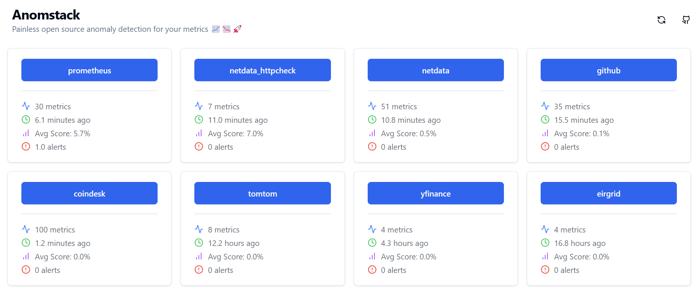
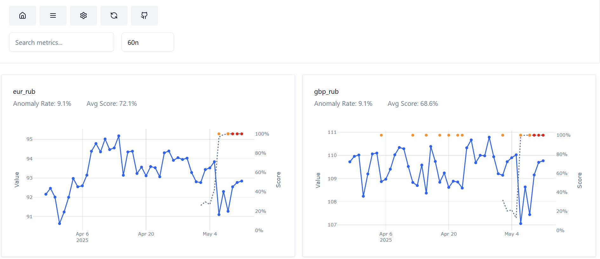
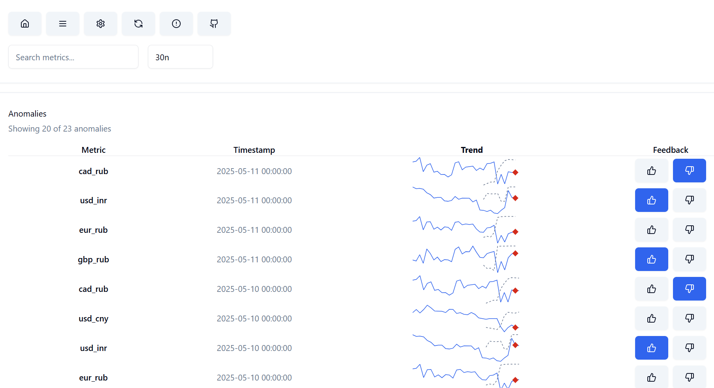
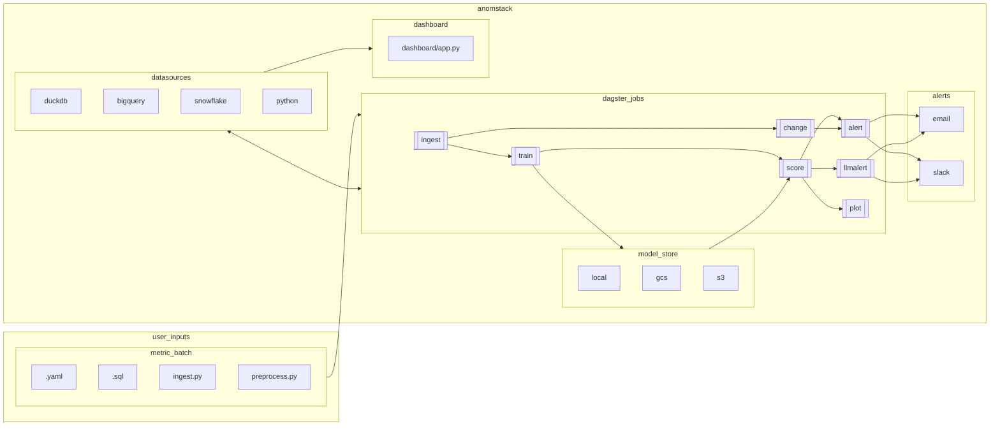
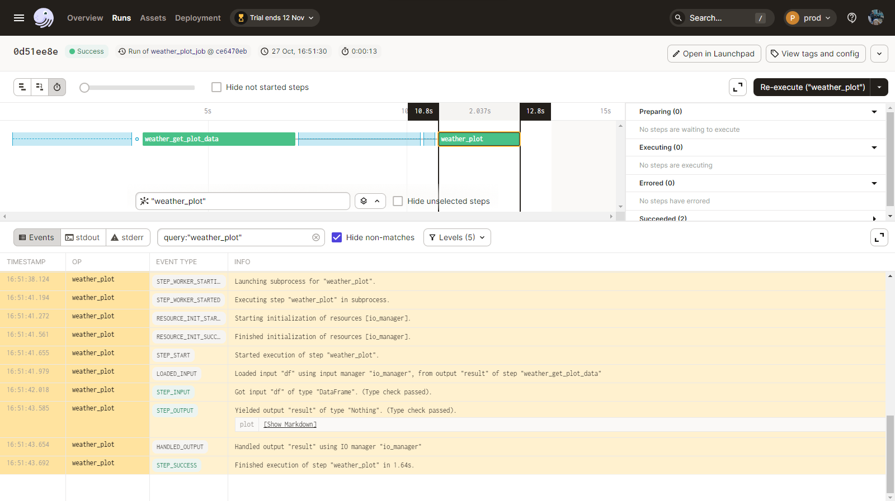
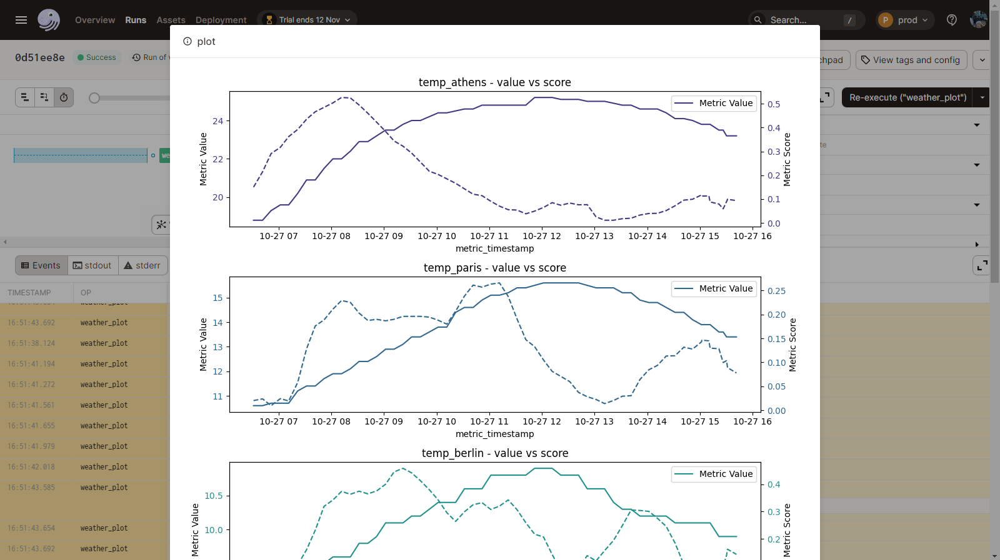
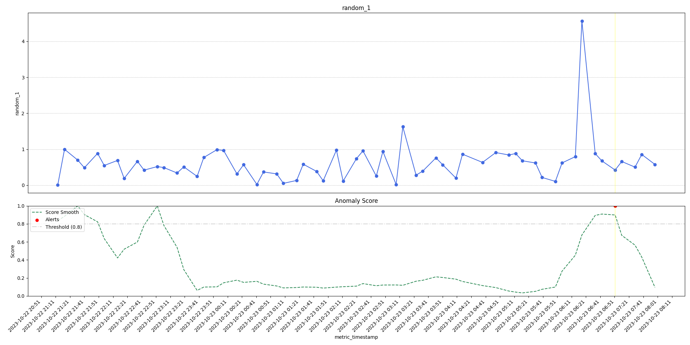
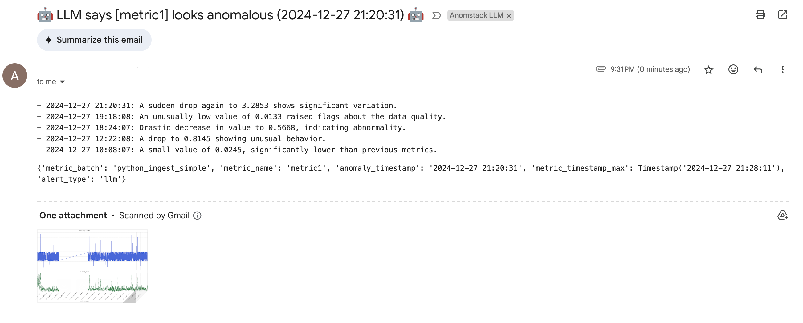
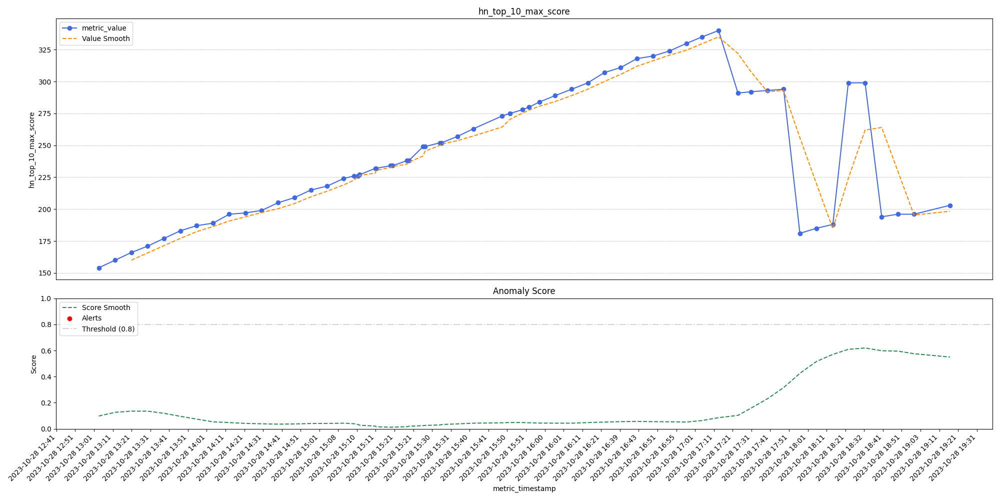

# Anomstack

[](https://codespaces.new/andrewm4894/anomstack)

[](https://replit.com/new/github/andrewm4894/anomstack)

[](https://andrewm4894.github.io/anomstack/docs/deployment/fly)

<div align="left">

<a href="https://github.com/andrewm4894/anomstack/stargazers"></a>
<a href="https://github.com/andrewm4894/anomstack/releases"></a>
<a href="https://andrewm4894.github.io/anomstack/"></a>
<a href="https://anomstack-demo.replit.app/"></a>
<a href="https://github.com/andrewm4894/anomstack/blob/main/LICENSE"></a>
<a href="https://github.com/andrewm4894/anomstack/actions/workflows/pytest.yaml"></a>
<a href="https://github.com/andrewm4894/anomstack/actions/workflows/pre-commit.yaml"></a>
<a href="./tests/README.md#coverage-report"></a>

</div>

Painless open source anomaly detection for your metrics! 📈📉🚀

> _Check out this [Data Engineering Podcast](https://www.dataengineeringpodcast.com/anomstack-open-source-business-metric-anomaly-detection-episode-404) where we discussed Anomstack and anomaly detection in general._

> _Note: If you are already using Airflow then also checkout the [`airflow-provider-anomaly-detection`](https://github.com/andrewm4894/airflow-provider-anomaly-detection) package._

App screenshots:

Homepage:


Metric batch view:


Anomaly list view:


## Contents

- [What is Anomstack?](#what-is-anomstack)
  - [How it works](#how-it-works)
  - [Why?](#why)
  - [Features](#features)
  - [Architecture](#architecture)
  - [Examples](#examples)
- [Project structure](#project-structure)
- [Quickstart](#quickstart)
  - [GitHub Codespaces](#github-codespaces)
  - [Dagster Cloud](#dagster-cloud)
  - [Fly.io Deployment](#flyio-deployment)
  - [Docker](#docker)
  - [Replit](#replit)
  - [Local Python env](#local-python-env)
- [Adding your metrics](#adding-your-metrics)
- [Dashboard](#dashboard)
- [Concepts](#concepts)
- [Alerts](#alerts)
- [LLM Agent Alerts](#llm-agent-alerts)
- [Contributing](#contributing)

Supported sources and databases for your metrics to live in and be queried from:

<table>
    <thead>
        <tr>
            <th align="center"><a href="./anomstack/fn/run.py" target="_blank">Python</a></th>
            <th align="center"><a href="./anomstack/external/gcp/bigquery.py" target="_blank">BigQuery</a></th>
            <th align="center"><a href="./anomstack/external/snowflake/snowflake.py" target="_blank">Snowflake</a></th>
            <th align="center"><a href="./anomstack/external/clickhouse/clickhouse.py" target="_blank">ClickHouse</a></th>
            <th align="center"><a href="./anomstack/external/duckdb/duckdb.py" target="_blank">DuckDB</a></th>
            <th align="center"><a href="./anomstack/external/sqlite/sqlite.py" target="_blank">SQLite</a></th>
            <th align="center"><a href="./anomstack/external/duckdb/duckdb.py" target="_blank">MotherDuck</a></th>
            <th align="center"><a href="./anomstack/external/sqlite/sqlite.py" target="_blank">Turso</a></th>
            <th align="center">Redshift</th>
        </tr>
    </thead>
    <tbody>
        <tr>
            <td align="center">✅</td>
            <td align="center">✅</td>
            <td align="center">✅</td>
            <td align="center">✅</td>
            <td align="center">✅</td>
            <td align="center">✅</td>
            <td align="center">✅</td>
            <td align="center">✅</td>
            <td align="center">🚧</td>
        </tr>
    </tbody>
</table>

Supported storage for your trained models:

<table>
    <thead>
        <tr>
            <th align="center"><a href="./anomstack/io/save.py" target="_blank">Local</a></th>
            <th align="center"><a href="./anomstack/external/gcp/gcs.py" target="_blank">GCS</a></th>
            <th align="center"><a href="./anomstack/external/aws/s3.py" target="_blank">S3</a></th>
            <th align="center">Azure Blob</th>
        </tr>
    </thead>
    <tbody>
        <tr>
            <td align="center">✅</td>
            <td align="center">✅</td>
            <td align="center">✅</td>
            <td align="center">🚧</td>
        </tr>
    </tbody>
</table>

Supported ways to receive [alerts](#alerts):

<table>
    <thead>
        <tr>
            <th align="center"><a href="./anomstack/alerts/email.py" target="_blank">Email</a></th>
            <th align="center"><a href="./anomstack/alerts/slack.py" target="_blank">Slack</a></th>
        </tr>
    </thead>
    <tbody>
        <tr>
            <td align="center">✅</td>
            <td align="center">✅</td>
        </tr>
    </tbody>
</table>

Supported ways to run this project:

<table>
    <thead>
        <tr>
            <th align="center"><a href="#local-python-env">Python Env</a></th>
            <th align="center"><a href="#docker">Docker</a></th>
            <th align="center"><a href="#fly-io-deployment">Fly.io</a></th>
            <th align="center"><a href="#dagster-cloud">Dagster Cloud</a></th>
            <th align="center"><a href="#github-codespaces">GitHub Codespaces</a></th>
            <th align="center"><a href="#replit">Replit</a></th>
        </tr>
    </thead>
    <tbody>
        <tr>
            <td align="center">✅</td>
            <td align="center">✅</td>
            <td align="center">🆕</td>
            <td align="center">✅</td>
            <td align="center">✅</td>
            <td align="center">✅</td>
        </tr>
    </tbody>
</table>

## What is Anomstack?

[back to top](#anomstack)

Anomstack is a lightweight (README buzzword bingo alert!) data app built on top of [dagster](https://dagster.io/) (for compute + orchestration) and [FastHTML](https://fastht.ml/) + [MonsterUI](https://github.com/AnswerDotAI/MonsterUI) (for dashboard) that lets you easily get great anomaly detection (using [`pyod`](https://pyod.readthedocs.io/en/latest/) for the ML stuff) for your metrics (whatever data platform you use) with as little pain as physically possible.

It's similar in scope and goal to this [Airflow Anomaly Detection provider](https://github.com/andrewm4894/airflow-provider-anomaly-detection) i also made, but easier to get going since does not require airflow and so easier to set up and run yourself or via [Dagster Cloud](#dagster-cloud) in a [serverless](https://docs.dagster.io/dagster-cloud/deployment/serverless) manner.

<details>
<summary>Quick 10 Minute Video Project Intro</summary>

[](https://youtu.be/wFxcQW0M9aM)

</details>

<details>
<summary>GitHub Star History - Lets Gooooo! :)</summary>

[](https://star-history.com/#andrewm4894/anomstack&Date)

</details>

### How it works

1. Define your metrics (part of a ["metric batch"](#concepts)) in a `.sql` file and corresponding config in a `.yaml` file. You can also define your own custom python ingest function instead of just SQL, check out the [`python_ingest_simple`](./metrics/examples/python/python_ingest_simple/python_ingest_simple.yaml) example.
1. Run Anomstack and it will automatically ingest, train, score, and alert (["jobs"](#concepts)) on your metrics and detect anomalies (alerts via email/slack etc.).
1. Get [alerts](#alerts) when metrics look anomalous.

### Why?

It's still too hard and messy to get decent out of the box anomaly detection on your metrics with minimal fuss. You either have to build some custom solution yourself or buy some sexy modern data stack tool that does it for you. This project aims to make it as easy as possible to get anomaly detection on your metrics without having to buy anything or build anything from scratch yourself.

### Features

[back to top](#anomstack)

Here is a list of features of Anomstack (emoji alert warning!)

1. 🌟 - You bring your metrics Anomstack will do the ML (❤️[PyOD](https://github.com/yzhao062/pyod)).
1. 🚀 - Easy to [run yourself](#docker) or via [Dagster Cloud](#dagster-cloud).
1. ⚙️ - Very flexible config, you can see all params in [`defaults.yaml`](./metrics/defaults/defaults.yaml) and override them in each metric batch config.
1. 🧠 - Ability to define your own custom python ingest function instead of just SQL, check out the [`python_ingest_simple`](./metrics/examples/python/python_ingest_simple/python_ingest_simple.yaml) example.
1. 🛠️ - Ability to define your own custom python preprocess function instead of the default at [`/metrics/defaults/python/preprocess.py`](./metrics/defaults/python/preprocess.py).
1. 📧 - Email [alerting](#alerts) with fancy(ish) ascii art plots of your metrics and anomaly scores.
1. 💬 - Slack alerts too (want to make these nicer).
1. 🤖 - aGeNtIc LLM based alerts - use an [anomaly-agent](https://github.com/andrewm4894/anomaly-agent) to do anomaly detection and alerting - see [LLM Agent Alerts](#llm-agent-alerts).
1. ⚠️ - Threshold-based alerts - traditional rules-based alerting with configurable upper and lower bounds that are evaluated at ingest time.
1. 🕒 - Ability to ingest at whatever frequency you want and then agg to a different level for training/scoring, see [`freq`](/metrics/examples/freq/README.md) example.
1. 📊 - Plot jobs so you can just eyeball your metrics in Dagster job logs, see [#dagster-ui-plots](#dagster-ui-plots).
1. 🏗️ - Minimal infrastructure requirements, Anomstack just reads from and writes to whatever database you use.
1. 📈 - A nice fancy local [FastHTML](https://fastht.ml/) + [MonsterUI](https://github.com/AnswerDotAI/MonsterUI) (❤️) dashboard to visualize your metrics and anomaly scores, see [#dashboard](#dashboard).
1. 📦 - Dockerized for easy deployment.
1. 🔔 - Scores & Alerts saved to database so you can query them and do whatever you want with them.
1. 🏷️ - Add custom metric tags for more complex alert routing e.g. priority or subject area based.
1. 🔄 - Change detection jobs out of the box.
1. 😴 - Ability to snooze alerts for a period of time to reduce repeated and duplicate alerts.
1. 👍 - Anomaly feedback system with thumbs up/down buttons to rate anomaly detection accuracy (see [#anomaly-list-view](#anomaly-list-view)).
1. 🗞️ - Daily summary emails.

### Architecture

#### The Moving Parts



#### Metrics Table

Core to what Anomstack is doing in reading from and appending to a "Metrics" table for each metric batch. This is a "long" format table where new metrics are appended to the table as they come in or are defined and configured as you add new metric batches.

Here are the columns in the metrics table:

- `metric_timestamp`: Timestamp of the metric (Defined in `ingest_sql` or `ingest_fn`).
- `metric_batch`: Name of the metric batch (Defined from `metric_batch` in the yaml config for the batch).
- `metric_name`: Name of the metric (Defined in `ingest_sql` or `ingest_fn`).
- `metric_type`: Type of the metric the row relates to.
  - `metric` for the raw metric value.
  - `score` for the anomaly score (a float from 0-1).
  - `alert` for an alert (a 1 when an alert was raised).
- `metric_value`: Value of the metric (coming from the ingest, score, or alert jobs (see [concepts](#concepts) for more details).

```SQL
SELECT
  metric_timestamp,
  metric_batch,
  metric_name,
  metric_type,
  metric_value,
FROM
  `metrics.metrics`
WHERE
  metric_batch = 'gsod'
  and
  metric_name = 'gsod_us_temp_avg'
ORDER BY metric_timestamp DESC
limit 10
/*
+--------------------------+------------+----------------+-----------+------------+
|metric_timestamp          |metric_batch|metric_name     |metric_type|metric_value|
+--------------------------+------------+----------------+-----------+------------+
|2023-11-12 00:00:00.000000|gsod        |gsod_us_temp_avg|score      |1           |
|2023-11-12 00:00:00.000000|gsod        |gsod_us_temp_avg|score      |1           |
|2023-11-12 00:00:00.000000|gsod        |gsod_us_temp_avg|alert      |1           |
|2023-11-12 00:00:00.000000|gsod        |gsod_us_temp_avg|metric     |44.4758     |
|2023-11-11 00:00:00.000000|gsod        |gsod_us_temp_avg|score      |1           |
|2023-11-11 00:00:00.000000|gsod        |gsod_us_temp_avg|score      |1           |
|2023-11-11 00:00:00.000000|gsod        |gsod_us_temp_avg|score      |1           |
|2023-11-11 00:00:00.000000|gsod        |gsod_us_temp_avg|metric     |46.3212     |
|2023-11-11 00:00:00.000000|gsod        |gsod_us_temp_avg|score      |1           |
|2023-11-11 00:00:00.000000|gsod        |gsod_us_temp_avg|metric     |46.3212     |
+--------------------------+------------+----------------+-----------+------------+
*/
```

Of course you can easily pivot this table to get a slightly more "wide" format table if you prefer and is easier for working with your analytics tools etc.

```SQL
SELECT
  metric_timestamp,
  metric_batch,
  metric_name,
  avg(if(metric_type='metric', metric_value, null)) as metric_value,
  avg(if(metric_type='score', metric_value, null)) as metric_score,
  max(if(metric_type='alert', metric_value, 0)) as metric_alert,
FROM
  `metrics.metrics`
WHERE
  metric_batch = 'gsod'
  and
  metric_name = 'gsod_us_temp_avg'
GROUP BY 1,2,3
ORDER BY metric_timestamp DESC
limit 10
/*
+--------------------------+------------+----------------+------------------+------------+------------+
|metric_timestamp          |metric_batch|metric_name     |metric_value      |metric_score|metric_alert|
+--------------------------+------------+----------------+------------------+------------+------------+
|2023-11-12 00:00:00.000000|gsod        |gsod_us_temp_avg|44.4758           |1           |1           |
|2023-11-11 00:00:00.000000|gsod        |gsod_us_temp_avg|46.3212           |1           |1           |
|2023-11-10 00:00:00.000000|gsod        |gsod_us_temp_avg|47.51435          |1           |0           |
|2023-11-08 00:00:00.000000|gsod        |gsod_us_temp_avg|51.7557           |1           |0           |
|2023-11-07 00:00:00.000000|gsod        |gsod_us_temp_avg|54.1946           |1           |0           |
|2023-11-06 00:00:00.000000|gsod        |gsod_us_temp_avg|53.8131           |1           |0           |
|2023-11-05 00:00:00.000000|gsod        |gsod_us_temp_avg|52.0883           |1           |0           |
|2023-11-04 00:00:00.000000|gsod        |gsod_us_temp_avg|47.8              |1           |0           |
|2023-11-03 00:00:00.000000|gsod        |gsod_us_temp_avg|48.752422407267225|1           |0           |
|2023-11-02 00:00:00.000000|gsod        |gsod_us_temp_avg|38.999010833725855|1           |0           |
+--------------------------+------------+----------------+------------------+------------+------------+
*/
```

### Examples

[back to top](#anomstack)

Here as some specific examples, there are lots more in the [`./metrics/examples/`](./metrics/examples/) folder.

#### HackerNews

##### Derive metrics from current top stories

In [`./metrics/examples/hackernews/`](./metrics/examples/hackernews/) you will find an example of using a custom Python function ([`hn_top_stories_scores.py`](./metrics/examples/hackernews/hn_top_stories_scores.py)) to pull current top 10 stories from HackerNew API and derive some metrics based on their score. This is all defined in the [`hn_top_stories_scores.yaml`](./metrics/examples/hackernews/hn_top_stories_scores.yaml)` configuration file for this metric batch.

#### GSOD

##### Derive metrics from public GSOD data in BigQuery

In [`./metrics/examples/gsod/`](./metrics/examples/gsod/) you will find an example of just defining some sql to derive a metric batch on data already in BigQuery ([`gsod.sql`](./metrics/examples/gsod/gsod.sql)) and ingest it into a table called `metrics` in a `metrics` dataset in a Google Bigquery project. This is all defined in the [`gsod.yaml`](./metrics/examples/gsod/gsod.yaml)` configuration file for this metric batch.

#### Weather

##### Use a custom python function to pull some weather metrics from the Open Meteo API

In [`./metrics/examples/weather/`](./metrics/examples/weather/) you will find an example of using a custom Python function ([`ingest_weather.py`](./metrics/examples/weather/ingest_weather.py)) to pull current temperature data for some cities from the Open Meteo API and ingest it into a table called `metrics` in a `metrics` dataset in a Google Bigquery project. This is all defined in the [`weather.yaml`](./metrics/examples/weather/weather.yaml)` configuration file for this metric batch.

#### Yahoo Finance

##### Use a custom python function to pull some Yahoo Finance data

In [`./metrics/examples/yfinance/`](./metrics/examples/yfinance/) you will find an example of using a custom Python function ([`yfinance.py`](./metrics/examples/yfinance/yfinance.py)) to pull current stock price data for some stocks and ingest it into a table called `metrics` in a `metrics` dataset in a Google Bigquery project. This is all defined in the [`yfinance.yaml`](./metrics/examples/yfinance/yfinance.yaml)` configuration file for this metric batch.

## Project structure

[back to top](#anomstack)

- [`./anomstack`](./anomstack) source code for Anomstack.
- [`./metrics`](./metrics) metrics `.sql` and `.yaml` configuration files. This is where you define your metrics (check out [`examples`](./metrics/examples/) folder). Defaults params etc live in [`defaults`](./metrics/defaults/) folder in [`defaults.yaml`](./metrics/defaults/defaults.yaml).

## Quickstart

[back to top](#anomstack)

Below are some quick start instructions for getting up and running with Anomstack and a local db using duckdb and some example metrics.

For proper use you would need to set up all your metrics and environment variables etc, but this should get you started.

By default Anomstack will run on port 3000, so you can go to http://localhost:3000 to see the dagster UI. You can then enable the jobs you want to run and see them run in the UI.

*Note*: you will need to wait for it to run a dozen or so ingest jobs before there is enough data for train, score and alert jobs to run successfully.

There are some more detailed instructions (WIP) in [`/docs/deployment/`](./docs/deployment/).

### GitHub Codespaces

[](https://codespaces.new/andrewm4894/anomstack)

You can run Anomstack using docker in a [GitHub Codespace](https://docs.github.com/en/codespaces). This is a great way to get started and familiar with Anomstack without having to install or run anything locally.

You can see the [`.devcontainer`](./.devcontainer) folder for the config used to run Anomstack in a codespace and the post create script [`post_create_command.sh`](.devcontainer/post_create_command.sh) for the commands the devcontainer will run to get Anomstack up and running.

### Dagster Cloud

You can run this project in Dagster Cloud. Fork the repo (or make a completely new repo using the `andrewm4894/anomstack` GitHub template) and then follow the instructions [here](https://docs.dagster.io/dagster-cloud/deployment/serverless#with-github) to deploy to Dagster Cloud from your forked repo.

You can then manage you metrics via PR's in your GitHub repo ([here](https://github.com/andrewm4894/anomstack/pull/40/files) is a PR to add Google Trends metrics) and run them in Dagster Cloud which will just sync with your repo.

### Fly.io Deployment

Deploy to [Fly.io](https://fly.io) for production-ready, globally distributed anomaly detection.

**🚀 Live Demo**: https://anomstack-demo.fly.dev

```bash
# New! Automatic .env integration 🎉
cp .example.env .env          # Edit with your secrets
make fly-preview              # Preview what will be deployed
make fly-deploy               # Deploy with your environment variables

# Or using scripts directly
./scripts/deployment/preview_fly_secrets.sh
./scripts/deployment/deploy_fly.sh
```

**✨ Features:**
- 🔒 **Secure secret management** via Fly secrets
- 🧠 **Smart filtering** (skips local-only variables)  
- 🔐 **Configurable admin credentials**
- 📊 **Public dashboard** + protected admin interface
- 🌐 **Global edge deployment** with auto-scaling
- 🗄️ **SQLite simplicity** - No separate database required!

See [full deployment docs](docs/docs/deployment/fly.md) for detailed instructions.

### Docker

To get started with Anomstack, you can run it via docker compose.

```bash
# clone repo
git clone https://github.com/andrewm4894/anomstack.git
# clone repo at specific release tag
# git clone -b v0.0.1 https://github.com/andrewm4894/anomstack.git
# cd into project
cd anomstack
# generate your .env file based on example
cp .example.env .env
# run docker compose up to start anomstack
docker compose up -d
# anomstack should now be running on port 3000
```

To update and rebuild after adding metrics or changing code, you can run:

```bash
# rebuild docker compose
docker compose build
# run docker compose up to re-start anomstack
docker compose up -d
```

**💡 Pro Tip:** Anomstack includes a comprehensive Makefile with many useful targets for development and deployment. For detailed documentation of all available commands, see [`Makefile.md`](./Makefile.md). Quick examples:

```bash
make docker-dev          # Start with local development images
make reset-interactive   # Interactive reset with cleanup options  
make docker-logs         # View all container logs
make tests              # Run test suite
```

### Replit

You can run Anomstack directly on Replit:

1. Click the "Open in Replit" button at the top of this README
2. Once the repl is created, let it finish installing dependencies
3. Click the "Run" button to start both the dashboard and backend services
4. The dashboard will be available at port 80 and Dagster UI at port 3000

The project is configured to run both the dashboard and Dagster backend in parallel through the "Full Stack" workflow defined in `.replit`. You can also run just the dashboard or backend separately using the other available workflows.

### Local Python env

You can also run Anomstack locally via a python virtual env.

```bash
# git clone
git clone https://github.com/andrewm4894/anomstack.git
# clone repo at specific release tag
# git clone -b v0.0.1 https://github.com/andrewm4894/anomstack.git
# cd into project
cd anomstack
# make virtual env
python3 -m venv .venv
# activate virtual env
source .venv/bin/activate
# install deps
pip3 install -r requirements.txt
# cp example env file
cp .example.env .env
# run locally
dagster dev -f anomstack/main.py
# anomstack should now be running on port 3000
```

## Adding your metrics

[back to top](#anomstack)

To add metrics, you can add them to the `metrics` folder. You can see some examples in the [`metrics/examples`](./metrics/examples/) folder.

For example, [here](https://github.com/andrewm4894/anomstack/pull/40/files) is the PR that added Google Trends metrics to the examples.

You can customize the default params for your metrics in the [`metrics/defaults`](./metrics/defaults/) folder.

Environment variables for your metrics can be set in the `.env` file (see [`.example.env`](.example.env) for examples and comments) or in the `docker-compose.yml` file.

### Overriding metric batch config with environment variables

You can override any config parameter for a specific metric batch using environment variables of the form:

```
ANOMSTACK__<METRIC_BATCH>__<PARAM>
```

- `<METRIC_BATCH>` should be the `metric_batch` name from your YAML config, uppercased (and with dashes replaced by underscores if present).
- `<PARAM>` should be the config parameter name, uppercased (use underscores, e.g. `ALERT_METHODS`).

**Example:**

Suppose you have a metric batch config with:

```yaml
metric_batch: "python_ingest_simple"
db: "duckdb"
alert_methods: "email,slack"
ingest_cron_schedule: "*/2 * * * *"
```

To override these via environment variables, add to your `.env` file:

```
ANOMSTACK__PYTHON_INGEST_SIMPLE__DB=bigquery
ANOMSTACK__PYTHON_INGEST_SIMPLE__ALERT_METHODS=email
ANOMSTACK__PYTHON_INGEST_SIMPLE__INGEST_CRON_SCHEDULE=*/1 * * * *
```

This will override the `db`, `alert_methods`, and `ingest_cron_schedule` parameters for the `python_ingest_simple` metric batch at runtime, without changing the YAML file.

This makes it easy to manage config via environment variables for different deployments or local development.

## Dashboard

[back to top](#anomstack)

You can run Anomstack in a sort of "headless mode" with no UI (if for example you want to use your existing analytics tools etc.).

That said, there is also a fancy [FastHTML](https://fastht.ml/) + [MonsterUI](https://github.com/AnswerDotAI/MonsterUI) (❤️) based dashboard that you can use to visualize your metrics and anomaly scores too (See the demo at https://anomstack-demo.replit.app/).

Dashboard code lives in [`./dashboard/app.py`](./dashboard/app.py)), use `make dashboard` or `make dashboardd` (to run as a daemon) to start it.

### Homepage

Simple homepage with some quick summary metrics for each metric batch.


### Metric Batch View

View all metrics in a batch with various UI settings, searchable and sorted by anomaly rate from highest to lowest. An "anomstack" if you will ;)


### Anomaly List View

A dedicated view to see all anomalies across your metrics with:
- Compact sparkline charts showing the metric trend and anomaly point
- Timestamp and metric name information
- Feedback system with thumbs up/down buttons to rate anomaly detection accuracy
- Pagination for easy navigation through large numbers of anomalies
- Feedback is persisted to your metrics database for future analysis


### Dagster UI Plots

Within Dagster there is the [`plot.py`](./anomstack/jobs/plot.py) job to generate some plots of your metrics and anomaly scores for quick eyeballing within the dagster UI.

<details>
<summary>Click to see some screenshots</summary>





</details>

## Concepts

[back to top](#anomstack)

- "**Metric Batch**": You configure metric batches in Anomstack. A metric batch is a collection of metrics that you want to run together and with its own separate set of parameters. Of course a metric batch can contain just one metric if you want but typically it makes more sense to group metrics in ways that make sense for you. A metric batch is just some SQL or custom Python that results in a Pandas DataFrame with `metric_timestamp`, `metric_name` and `metric_value` columns.
- "**Jobs**": At the core Anomstack runs a few jobs ([Dagster Jobs](https://docs.dagster.io/concepts/ops-jobs-graphs/jobs)) for each metric batch. These jobs are:
  - "Ingest" ([`ingest.py`](./anomstack/jobs/ingest.py)): This job runs the sql query (or Python function) for the metric batch and ingests the data into the database.
  - "Train" ([`train.py`](./anomstack/jobs/train.py)): This job trains a model for each metric.
  - "Score" ([`score.py`](./anomstack/jobs/score.py)): This job scores metrics using the latest trained model for each metric.
  - "Alert" ([`alert.py`](./anomstack/jobs/alert.py)): This job alerts you when the metric looks anomalous.
  - "LLM Alert" ([`llmalert.py`](./anomstack/jobs/llmalert.py)): This job alerts you when the metric looks anomalous as decided by a LLM (ChatGPT).
  - "Plot" ([`plot.py`](./anomstack/jobs/plot.py)): This job plots metric values and scores for a batch at regular intervals so you can see some charts from within the Dagster UI.

## Alerts

[back to top](#anomstack)

_Check out more example alerts in the [anomaly gallery](./gallery/)._

Anomstack supports alerts via email and slack. You can configure these in the `.env` file (see [`.example.env`](.example.env) for examples and comments).

Below is an example of an alert via email. Attached is a png plot with more details.



## LLM Agent Alerts

[back to top](#anomstack)

Yes! I have managed to find a way to ram a large language (LLM) ~~model~~ 🚀AGENT🚀 into this project.

Idea here is to just send the metric data and prompt to an LLM Agent (built with the [anomaly-agent](https://github.com/andrewm4894/anomaly-agent)) and ask it if it thinks the metric looks anomalous (and run a verification chain to check it and also provide back an explanation for each anomaly). If it does, we alert.

Notes:
- If you don't want to send your metric data to OpenAI then just set `disable_llmalert` to `True` in your metric batch config.
- Going to add and validate [Ollama](https://ollama.com/) support soon for local LLM Agent.
- Will be developing this more in its own library (for use in both Anomstack and any other projects) over at [anomaly-agent](https://github.com/andrewm4894/anomaly-agent) dig in there for more details.

<details>
<summary>Click to see some LLM Alert screenshots</summary>

Below you see an example of an LLM alert via email. In this case we add a description of the reasoning from the LLM around why it thinks the metric looks anomalous.





</details>

## Killing Long Running Jobs

Sometimes Dagster runs can get stuck. Anomstack ships with a sensor that
terminates any run exceeding a configurable timeout. By default runs are killed
after 15 minutes. You can override this in your `dagster.yaml` or via the
`ANOMSTACK_KILL_RUN_AFTER_MINUTES` environment variable. You can also invoke the
cleanup manually with:

```bash
make kill-long-runs
```

## Contributing

Read the [contributing guide](./CONTRIBUTING.md) to learn about our development process, how to propose bugfixes and improvements, and how to build and test your changes to Anomstack.
