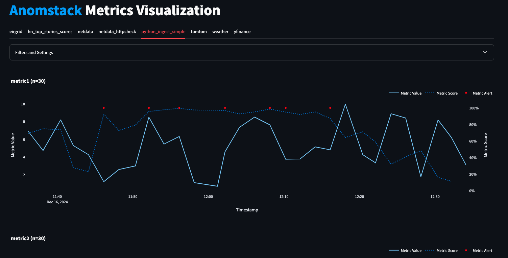
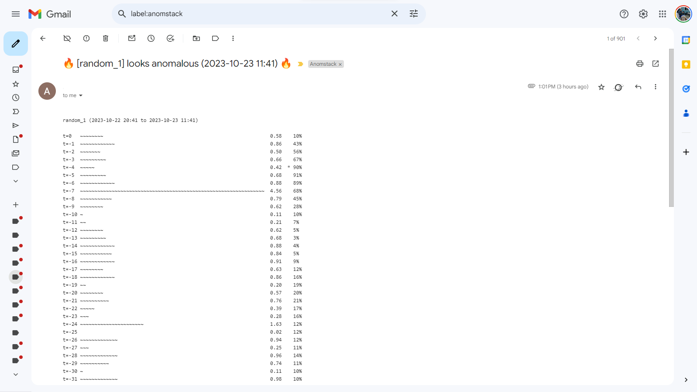

# Anomstack

[](https://codespaces.new/andrewm4894/anomstack)

<div align="left">

<a href="https://github.com/andrewm4894/anomstack/stargazers"></a>
<a href="https://github.com/andrewm4894/anomstack/releases"></a>
<a href="https://github.com/andrewm4894/anomstack/blob/main/LICENSE"></a>
<a href="https://github.com/andrewm4894/anomstack/actions/workflows/pytest.yaml"></a>
<a href="https://github.com/andrewm4894/anomstack/actions/workflows/deploy.yml"></a>
<a href="https://github.com/andrewm4894/anomstack/actions/workflows/pre-commit.yaml"></a>

</div>

Painless open source anomaly detection for your metrics! 📈📉🚀

- [What is Anomstack?](#what-is-anomstack)
  - [How it works](#how-it-works)
  - [Why?](#why)
  - [Architecture](#architecture)
  - [Features](#features)
  - [Examples](#examples)
- [Project structure](#project-structure)
- [Quickstart](#quickstart)
  - [GitHub Codespaces](#github-codespaces)
  - [Dagster Cloud](#dagster-cloud)
  - [Docker](#docker)
  - [Local Python env](#local-python-env)
- [Adding your metrics](#adding-your-metrics)
- [Visualization](#visualization)
- [Concepts](#concepts)
- [Alerts](#alerts)
- [LLM Alerts](#llm-alerts)
- [Contributing](#contributing)

Supported sources and databases for your metrics to live in and be queried from:

<table>
    <thead>
        <tr>
            <th align="center"><a href="./anomstack/fn/run.py">Python</a></th>
            <th align="center"><a href="./anomstack/external/gcp/bigquery.py">BigQuery</a></th>
            <th align="center"><a href="./anomstack/external/snowflake/snowflake.py">Snowflake</a></th>
            <th align="center"><a href="./anomstack/external/duckdb/duckdb.py">DuckDB</a></th>
            <th align="center">Redshift</th>
        </tr>
    </thead>
    <tbody>
        <tr>
            <td align="center">✅</td>
            <td align="center">✅</td>
            <td align="center">✅</td>
            <td align="center">✅</td>
            <td align="center">🚧</td>
        </tr>
    </tbody>
</table>

Supported storage for your trained models:

<table>
    <thead>
        <tr>
            <th align="center"><a href="./anomstack/io/save.py">Local</a></th>
            <th align="center"><a href="./anomstack/external/gcp/gcs.py">GCS</a></th>
            <th align="center"><a href="./anomstack/external/aws/s3.py">S3</a></th>
            <th align="center">Azure Blob</th>
        </tr>
    </thead>
    <tbody>
        <tr>
            <td align="center">✅</td>
            <td align="center">✅</td>
            <td align="center">✅</td>
            <td align="center">🚧</td>
        </tr>
    </tbody>
</table>

Supported ways to run this project:

<table>
    <thead>
        <tr>
            <th align="center"><a href="#local-python-env">Python Env</a></th>
            <th align="center"><a href="#docker">Docker</a></th>
            <th align="center"><a href="#dagster-cloud">Dagster Cloud</a></th>
            <th align="center"><a href="#github-codespaces">GitHub Codespaces</a></th>
        </tr>
    </thead>
    <tbody>
        <tr>
            <td align="center">✅</td>
            <td align="center">✅</td>
            <td align="center">✅</td>
            <td align="center">✅</td>
        </tr>
    </tbody>
</table>

## What is Anomstack?

[back to top](#anomstack)

Anomstack is a lightweight (README buzzword bingo alert!) data app built on top of [dagster](https://dagster.io/) (for orchestration) that lets you easily get great anomaly detection (using [`pyod`](https://pyod.readthedocs.io/en/latest/) for the ML stuff) for your metrics (whatever data platform you use) with as little pain as physically possible.

It's similar in scope and goal to this [Airflow Anomaly Detection provider](https://github.com/andrewm4894/airflow-provider-anomaly-detection) i also made, but easier to get going since does not require airflow and so easier to set up and run yourself or via [Dagster Cloud](#dagster-cloud) in a [serverless](https://docs.dagster.io/dagster-cloud/deployment/serverless) manner.

<details>
<summary>Quick 10 Minute Video Project Intro</summary>

[](https://www.youtube.com/watch?v=NyAKQ8H7JMw)

</details>

<details>
<summary>GitHub Star History - Lets Gooooo! :)</summary>

[](https://star-history.com/#andrewm4894/anomstack&Date)

</details>

### How it works

1. Define your metrics (part of a ["metric batch"](#concepts)) in a `.sql` file and corresponding config in a `.yaml` file. You can also define your own custom python ingest function instead of just SQL, check out the [`python_ingest_simple`](./metrics/examples/python/python_ingest_simple/python_ingest_simple.yaml) example.
1. Run Anomstack and it will automatically ingest, train, score, and alert (["jobs"](#concepts)) on your metrics and detect anomalies (alerts via email/slack etc.).
1. Get [alerts](#alerts) when metrics look anomalous.

### Why?

It's still too hard and messy to get decent out of the box anomaly detection on your metrics with minimal fuss. You either have to build some custom solution yourself or buy some modern data stack tool that does it for you. This project aims to make it as easy as possible to get anomaly detection on your metrics without having to buy anything or build anything from scratch yourself.

### Architecture


### Features

[back to top](#anomstack)

Here is a list of features of Anomstack (emoji alert warning!)

1. 🌟 - You bring your metrics Anomstack will do the ML (❤️[PyOD](https://github.com/yzhao062/pyod)).
2. 🚀 - Easy to run yourself or via [Dagster Cloud](#dagster-cloud).
3. ⚙️ - Very flexible config, you can see all params in [`defaults.yaml`](./metrics/defaults/defaults.yaml) and override them in each metric batch config.
4. 🧠 - Ability to define your own custom python ingest function instead of just SQL, check out the [`python_ingest_simple`](./metrics/examples/python/python_ingest_simple/python_ingest_simple.yaml) example.
5. 🛠️ - Ability to define your own custom python preprocess function instead of the default at [`/metrics/defaults/python/preprocess.py`](./metrics/defaults/python/preprocess.py).
6. 📧 - Email [alerting](#alerts) with fancy(ish) ascii art plots of your metrics and anomaly scores.
7. 💬 - Slack alerts too (want to make these nicer).
8. 🤖 - LLM based alerts (ChatGPT) - see [LLM Alerts](#llm-alerts). p.s. they don't work great yet - experimental :)
9. 🕒 - Ability to ingest at whatever frequency you want and then agg to a different level for training/scoring, see [`freq`](/metrics/examples/freq/README.md) example.
10. 📊 - Plot jobs so you can just eyeball your metrics in Dagster job logs, see [#dagster-ui-plots](#dagster-ui-plots).
11. 🏗️ - Minimal infrastructure requirements, Anomstack just reads from and writes to whatever database you use.
12. 📈 - A nice little local [Streamlit](https://streamlit.io/) dashboard to visualize your metrics and anomaly scores, see [#streamlit](#streamlit).
13. 📦 - Dockerized for easy deployment.
14. 🔔- Scores & Alerts saved to database so you can query them and do whatever you want with them.

### Examples

[back to top](#anomstack)

Here as some specific examples, there are lots more in the [`./metrics/examples/`](./metrics/examples/) folder.

#### HackerNews

##### Derive metrics from current top stories

In [`./metrics/examples/hackernews/`](./metrics/examples/hackernews/) you will find an example of using a customer Python function ([`hn_top_stories_scores.py`](./metrics/examples/hackernews/hn_top_stories_scores.py)) to pull current top 10 stories from HackerNew API and derive some metrics based on their score. This is all defined in the [`hn_top_stories_scores.yaml`](./metrics/examples/hackernews/hn_top_stories_scores.yaml)` configuration file for this metric batch.

#### GSOD

##### Derive metrics from public GSOD data in BigQuery

In [`./metrics/examples/gsod/`](./metrics/examples/gsod/) you will find an example of just defining some sql to derive a metric batch on data already in BigQuery ([`gsod.sql`](./metrics/examples/gsod/gsod.sql)) and ingest it into a table called `metrics` in a `metrics` dataset in a Google Bigquery project. This is all defined in the [`gsod.yaml`](./metrics/examples/gsod/gsod.yaml)` configuration file for this metric batch.

#### Weather

##### Use a custom python function to pull some weather metrics from the Open Meteo API

In [`./metrics/examples/weather/`](./metrics/examples/weather/) you will find an example of using a customer Python function ([`ingest_weather.py`](./metrics/examples/weather/ingest_weather.py)) to pull current temperature data for some cities from the Open Meteo API and ingest it into a table called `metrics` in a `metrics` dataset in a Google Bigquery project. This is all defined in the [`weather.yaml`](./metrics/examples/weather/weather.yaml)` configuration file for this metric batch.

#### Yahoo Finance

##### Use a custom python function to pull some Yahoo Finance data

In [`./metrics/examples/yfinance/`](./metrics/examples/yfinance/) you will find an example of using a customer Python function ([`yfinance.py`](./metrics/examples/yfinance/yfinance.py)) to pull current stock price data for some stocks and ingest it into a table called `metrics` in a `metrics` dataset in a Google Bigquery project. This is all defined in the [`yfinance.yaml`](./metrics/examples/yfinance/yfinance.yaml)` configuration file for this metric batch.

## Project structure

[back to top](#anomstack)

- [`./anomstack`](./anomstack) source code for Anomstack.
- [`./metrics`](./metrics) metrics `.sql` and `.yaml` configuration files. This is where you define your metrics (check out [`examples`](./metrics/examples/) folder). Defaults params etc live in [`defaults`](./metrics/defaults/) folder in [`defaults.yaml`](./metrics/defaults/defaults.yaml).

## Quickstart

[back to top](#anomstack)

Below are some quick start instructions for getting up and running with Anomstack and a local db using duckdb and some example metrics.

For proper use you would need to set up all your metrics and environment variables etc, but this should get you started.

By default Anomstack will run on port 3000, so you can go to http://localhost:3000 to see the dagster UI. You can then enable the jobs you want to run and see them run in the UI.

*Note*: you will need to wait for it to run a dozen or so ingest jobs before there is enough data for train, score and alert jobs to run successfully.

There are some more detailed instructions (WIP) in [`/docs/deployment/`](./docs/deployment/).

### GitHub Codespaces

[](https://codespaces.new/andrewm4894/anomstack)

You can run Anomstack using docker in a [GitHub Codespace](https://docs.github.com/en/codespaces). This is a great way to get started and familiar with Anomstack without having to install or run anything locally.

You can see the [`.devcontainer`](./.devcontainer) folder for the config used to run Anomstack in a codespace and the post create script [`post_create_command.sh`](.devcontainer/post_create_command.sh) for the commands the devcontainer will run to get Anomstack up and running.

### Dagster Cloud

You can run this project in Dagster Cloud. Fork the repo (or make a completely new repo using the `andrewm4894/anomstack` GitHub template) and then follow the instructions [here](https://docs.dagster.io/dagster-cloud/deployment/serverless#with-github) to deploy to Dagster Cloud from your forked repo.

You can then manage you metrics via PR's in your GitHub repo ([here](https://github.com/andrewm4894/anomstack/pull/40/files) is a PR to add Google Trends metrics) and run them in Dagster Cloud which will just sync with your repo.

### Docker

To get started with Anomstack, you can run it via docker compose.

```bash
# clone repo
git clone https://github.com/andrewm4894/anomstack.git
# clone repo at specific release tag
# git clone -b v0.0.1 https://github.com/andrewm4894/anomstack.git
# cd into project
cd anomstack
# generate your .env file based on example
cp .example.env .env
# run docker compose up to start anomstack
docker compose up
# anomstack should now be running on port 3000
```

### Local Python env

You can also run Anomstack locally via a python virtual env.

```bash
# git clone
git clone https://github.com/andrewm4894/anomstack.git
# clone repo at specific release tag
# git clone -b v0.0.1 https://github.com/andrewm4894/anomstack.git
# cd into project
cd anomstack
# make virtual env
python3 -m venv .venv
# activate virtual env
source .venv/bin/activate
# install deps
pip3 install -r requirements.txt
# cp example env file
cp .example.env .env
# run locally
dagster dev -f anomstack/main.py
# anomstack should now be running on port 3000
```

## Adding your metrics

[back to top](#anomstack)

To add metrics, you can add them to the `metrics` folder. You can see some examples in the [`metrics/examples`](./metrics/examples/) folder.

For example, [here](https://github.com/andrewm4894/anomstack/pull/40/files) is the PR that added Google Trends metrics to the examples.

You can customize the default params for your metrics in the [`metrics/defaults`](./metrics/defaults/) folder.

Environment variables for your metrics can be set in the `.env` file (see [`.example.env`](.example.env) for examples and comments) or in the `docker-compose.yml` file.

## Visualization

[back to top](#anomstack)

Visualization of the metrics and anomaly scores is a bit outside the scope of this project, but we do provide a couple of ways to visualize your metrics and anomaly scores.

### Dagster UI Plots

Within Dagster there is the [`plot.py`](./anomstack/jobs/plot.py) job to generate some plots of your metrics and anomaly scores for quick eyeballing within the dagster UI.

<details>
<summary>Click to see some screenshots</summary>


</details>

### Streamlit

You can also use the little streamlit app in [`./dashboard.py`](./dashboard.py) to visualize your metrics and anomaly scores.

```bash
# run streamlit app
streamlit run .\dashboard.py
```

...Or you can run it via `make dashboard`.

<details>
<summary>Click to see some screenshots</summary>




</details>

## Concepts

[back to top](#anomstack)

- "**Metric Batch**": You configure metric batches in Anomstack. A metric batch is a collection of metrics that you want to run together and with its own separate set of parameters. Of course a metric batch can contain just one metric if you want but typically it makes more sense to group metrics in ways that make sense for you. A metric batch is just some SQL or custom Python that results in a Pandas DataFrame with `metric_timestamp`, `metric_name` and `metric_value` columns.
- "**Jobs**": At the core Anomstack runs a few jobs ([Dagster Jobs](https://docs.dagster.io/concepts/ops-jobs-graphs/jobs)) for each metric batch. These jobs are:
  - "Ingest" ([`ingest.py`](./anomstack/jobs/ingest.py)): This job runs the sql query (or Python function) for the metric batch and ingests the data into the database.
  - "Train" ([`train.py`](./anomstack/jobs/train.py)): This job trains a model for each metric.
  - "Score" ([`score.py`](./anomstack/jobs/score.py)): This job scores metrics using the latest trained model for each metric.
  - "Alert" ([`alert.py`](./anomstack/jobs/alert.py)): This job alerts you when the metric looks anomalous.
  - "LLM Alert" ([`llmalert.py`](./anomstack/jobs/llmalert.py)): This job alerts you when the metric looks anomalous as decided by a LLM (ChatGPT).
  - "Plot" ([`plot.py`](./anomstack/jobs/plot.py)): This job plots metric values and scores for a batch at regular intervals so you can see some charts from within the Dagster UI.

## Alerts

[back to top](#anomstack)

_Check out more example alerts in the [anomaly gallery](./gallery/)._

Anomstack supports alerts via email and slack. You can configure these in the `.env` file (see [`.example.env`](.example.env) for examples and comments).

Below is an example of an alert via email. It has some ascii art plotting recent metric values and which observations were anomalous. Attached is a png plot with more details.



And the attached plot will look something like this:


## LLM Alerts

[back to top](#anomstack)

Yes! I have managed to find a way to ram a large language model (LLM) into this project. But you know what, it might just work...

**Update**: It works horribly, but it works! 🤣. Still need to do a lot more prompt engineering to get this to work well, but it's a start.

Idea here is to just send the metric data and prompt to a LLM (ChatGPT) and ask it if it thinks the metric looks anomalous. If it does, we alert.

Note: If you don't want to send your metric data to OpenAI then just set `disable_llmalert` to `True` in your metric batch config.

<details>
<summary>Click to see some LLM Alert screenshots</summary>

Below you see an example of an LLM alert via email. In this case we add a description of the reasoning from the LLM around why it thinks the metric looks anomalous.


</details>

## Contributing

Read the [contributing guide](./CONTRIBUTING.md) to learn about our development process, how to propose bugfixes and improvements, and how to build and test your changes to Anomstack.
