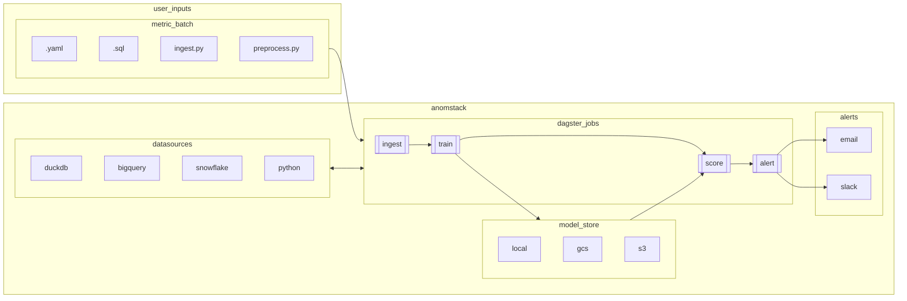

# Anomstack

[](https://codespaces.new/andrewm4894/anomstack)

[](https://opensource.org/licenses/MIT)

Painless open source anomaly detection for your metrics! 📈📉🚀

(firstly and most importantly...please star - it helps motivate me and im shallow like that 😅)

- [What is Anomstack?](#what-is-anomstack)
  - [How it works](#how-it-works)
  - [Why?](#why)
  - [Architecture](#architecture)
  - [Examples](#examples)
    - [Weather](#weather)
    - [GSOD](#gsod)
- [Project structure](#project-structure)
- [Quickstart](#quickstart)
  - [GitHub Codespaces](#github-codespaces)
  - [Dagster Cloud](#dagster-cloud)
  - [Docker](#docker)
  - [Local Python env](#local-python-env)
- [Adding your metrics](#adding-your-metrics)
- [Concepts](#concepts)
- [Alerts](#alerts)

Supported sources and databases for your metrics to live in and be queried from:

<table>
    <thead>
        <tr>
            <th align="center"><a href="./anomstack/fn/run.py">Python</a></th>
            <th align="center"><a href="./anomstack/external/gcp/bigquery.py">BigQuery</a></th>
            <th align="center"><a href="./anomstack/external/snowflake/snowflake.py">Snowflake</a></th>
            <th align="center"><a href="./anomstack/external/duckdb/duckdb.py">DuckDB</a></th>
            <th align="center">Redshift</th>
        </tr>
    </thead>
    <tbody>
        <tr>
            <td align="center">✅</td>
            <td align="center">✅</td>
            <td align="center">✅</td>
            <td align="center">✅</td>
            <td align="center">🚧</td>
        </tr>
    </tbody>
</table>

Supported storage for your trained models:

<table>
    <thead>
        <tr>
            <th align="center"><a href="./anomstack/io/save.py">Local</a></th>
            <th align="center"><a href="./anomstack/external/gcp/gcs.py">GCS</a></th>
            <th align="center"><a href="./anomstack/external/aws/s3.py">S3</a></th>
            <th align="center">Azure Blob</th>
        </tr>
    </thead>
    <tbody>
        <tr>
            <td align="center">✅</td>
            <td align="center">✅</td>
            <td align="center">✅</td>
            <td align="center">🚧</td>
        </tr>
    </tbody>
</table>

Supported ways to run this project:

<table>
    <thead>
        <tr>
            <th align="center"><a href="#local-python-env">Python Env</a></th>
            <th align="center"><a href="#docker">Docker</a></th>
            <th align="center"><a href="#dagster-cloud">Dagster Cloud</a></th>
            <th align="center"><a href="#github-codespaces">GitHub Codespaces</a></th>
        </tr>
    </thead>
    <tbody>
        <tr>
            <td align="center">✅</td>
            <td align="center">✅</td>
            <td align="center">✅</td>
            <td align="center">✅</td>
        </tr>
    </tbody>
</table>

## What is Anomstack?

[back to top](#anomstack)

Anomstack is a lightweight (README buzzword bingo alert!) data app built on top of [dagster](https://dagster.io/) (for orchestration) that lets you easily get great anomaly detection (using [`pyod`](https://pyod.readthedocs.io/en/latest/) for the ML stuff) for your business metrics (whatever data platform you use) with as little pain as physically possible.

It's similar in scope and goal to this [Airflow Anomaly Detection provider](https://github.com/andrewm4894/airflow-provider-anomaly-detection) i also made, but easier to get going since does not require airflow and so easier to set up and run yourself.

### How it works

1. Define your metrics (part of a ["metric batch"](#concepts)) in a `.sql` file and corresponding config in a `.yaml` file.  
  (_Note: you can also define your own custom python ingest function instead of just SQL, check out the [`python_ingest_simple`](./metrics/examples/python/python_ingest_simple/python_ingest_simple.yaml) example_)
1. Run Anomstack and it will automatically ingest, train, score, and alert (["jobs"](#concepts)) on your metrics and detect anomalies (alerts via email/slack etc.).
1. Get alerts when metrics look anomalous.

### Why?

It's still too hard and messy to get decent out of the box anomaly detection on your metrics. You either have to build some custom solution yourself or buy some modern data stack tool that does it for you. This project aims to make it as easy as possible to get anomaly detection on your metrics without having to buy anything or build anything from scratch yourself.

### Architecture



### Examples

[back to top](#anomstack)

#### Weather

In [`./metrics/examples/weather/`](./metrics/examples/weather/) you will find an example of using a customer Python function ([`ingets_weather.py`](./metrics/examples/weather/ingest_weather.py)) to pull current temperature data for some cities from the Open Meteo API and ingest it into a table called `metrics` in a `metrics` dataset in a Google Bigquery project. This is all defined in the [`weather.yaml`](./metrics/examples/weather/weather.yaml)` configuration file for this metric batch.

#### GSOD

In [`./metrics/examples/gsod/`](./metrics/examples/gsod/) you will find an example of just defining some sql to derive a metric batch on data already in BigQuery ([`gsod.sql`](./metrics/examples/gsod/gsod.sql)) and ingest it into a table called `metrics` in a `metrics` dataset in a Google Bigquery project. This is all defined in the [`gsod.yaml`](./metrics/examples/gsod/gsod.yaml)` configuration file for this metric batch.

## Project structure

[back to top](#anomstack)

- [`./anomstack`](./anomstack) source code for Anomstack.
- [`./metrics`](./metrics) metrics `.sql` and `.yaml` configuration files. This is where you define your metrics (check out [`examples`](./metrics/examples/) folder). Defaults params etc live in [`defaults`](./metrics/defaults/) folder in [`defaults.yaml`](./metrics/defaults/defaults.yaml).

## Quickstart

Below are some quick start instructions for getting up and running with Anomstack and a local db using duckdb and some example metrics.

For proper use you would need to set up all your metrics and environment variables etc, but this should get you started.

By default Anomstack will run on port 3000, so you can go to http://localhost:3000 to see the dagster UI. You can then enable the jobs you want to run and see them run in the UI.

*Note*: you will need to wait for it to run a dozen or so ingest jobs before there is enough data for train, score and alert jobs to run successfully.

### GitHub Codespaces

[](https://codespaces.new/andrewm4894/anomstack)

You can run Anomstack using docker in a [GitHub Codespace](https://docs.github.com/en/codespaces). This is a great way to get started and familiar with Anomstack without having to install or run anything locally.

You can see the [`.devcontainer`](./.devcontainer) folder for the config used to run Anomstack in a codespace and the post create script [`post_create_command.sh`](.devcontainer/post_create_command.sh) for the commands the devcontainer will run to get Anomstack up and running.

### Dagster Cloud

You can run this project in Dagster Cloud. Fork the repo (or make a completely new repo using the `andrewm4894/anomstack` GitHub template) and then follow the instructions [here](https://docs.dagster.io/dagster-cloud/deployment/serverless#with-github) to deploy to Dagster Cloud from your forked repo.

You can then manage you metrics via GitHub and run them in Dagster Cloud.

### Docker

To get started with Anomstack, you can run it via docker compose.

```bash
# clone repo
git clone https://github.com/andrewm4894/anomstack.git
# cd into project
cd anomstack
# generate your .env file based on example
cp .example.env .env
# run docker compose up to start anomstack
docker compose up
# anomstack should now be running on port 3000
```

### Local Python env

You can also run Anomstack locally via a python virtual env.

```bash
# git clone
git clone https://github.com/andrewm4894/anomstack.git
# cd into project
cd anomstack
# make virtual env
python3 -m venv .venv
# activate virtual env
source .venv/bin/activate
# install deps
pip3 install -r requirements.txt
# cp example env file
cp .example.env .env
# run locally
dagster dev -f anomstack/main.py
# anomstack should now be running on port 3000
```

## Adding your metrics

[back to top](#anomstack)

To add metrics, you can add them to the `metrics` folder. You can see some examples in the [`metrics/examples`](./metrics/examples/) folder.

You can customize the default params for your metrics in the [`metrics/defaults`](./metrics/defaults/) folder.

Environment variables for your metrics can be set in the `.env` file (see [`.example.env`](.example.env) for examples and comments) or in the `docker-compose.yml` file.

## Concepts

[back to top](#anomstack)

- "**Metric Batch**": You configure metric batches in Anomstack. A metric batch is a collection of metrics that you want to run together and with its own separate set of parameters. Of course a metric batch can contain just one metric if you want but typically it makes more sense to group metrics in ways that make sense for you. A metric batch is just some SQL or custom Python that results in a Pandas DataFrame with `metric_timestamp`, `metric_name` and `metric_value` columns.
- "**Jobs**": At the core Anomstack runs a few jobs for each metric batch. These jobs are:
  - "Ingest" ([`ingest.py`](./anomstack/jobs/ingest.py)): This job runs the sql query for the metric batch and ingests the data into the database.
  - "Train" ([`train.py`](./anomstack/jobs/train.py)): This job trains a model for each metric.
  - "Score" ([`score.py`](./anomstack/jobs/score.py)): This job scores metrics using the latest trained model for each metric.
  - "Alert" ([`alert.py`](./anomstack/jobs/alert.py)): This job alerts you when the metric looks anomalous.

## Alerts

[back to top](#anomstack)

Anomstack supports alerts via email and slack. You can configure these in the `.env` file (see [`.example.env`](.example.env) for examples and comments).

Below is an example of an alert via email. It has some ascii art plotting recent metric values and which observations were anomalous. Attached is a png plot with more details.


And the attached plot will look something like this:


