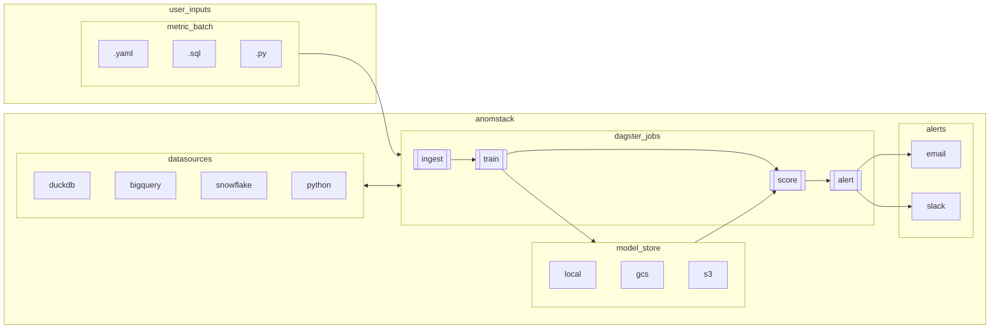

```mermaid
flowchart LR;

    metric_batch_config[config]
    metric_batch_sql[sql]
    metric_batch_py[py]
    ingest[[ingest]]
    train[[train]]
    score[[score]]
    alert[[alert]]

    subgraph metric_batch
    metric_batch_config[".yaml"]
    metric_batch_sql[".sql"]
    metric_batch_py[".py"]
    end

    subgraph dagster_jobs
    ingest
    train
    score
    alert
    end

    subgraph alerts
    email
    slack
    end

    subgraph datasources
    duckdb
    bigquery
    snowflake
    python
    end

    subgraph user_inputs
    metric_batch
    end

    subgraph anomstack
    dagster_jobs
    datasources
    model_store
    alerts
    end

    subgraph model_store
    local
    gcs
    s3
    end

    ingest --> train
    train --> score
    score --> alert

    metric_batch --> dagster_jobs

    alert --> email
    alert --> slack

    datasources <--> dagster_jobs
    train --> model_store
    model_store --> score

```
