# Deployment Overview

Anomstack offers flexible deployment options to fit different organizational needs and infrastructure requirements. This page helps you choose the right deployment pattern for your use case.

:::info Architecture Simplification
🎉 **Anomstack now uses gRPC-free architecture by default!** This means simpler deployment, better reliability, and no separate code server needed. User code is loaded directly as Python modules within the Dagster webserver.

For advanced use cases requiring separate gRPC code servers, see our [Architecture documentation](https://github.com/andrewm4894/anomstack/blob/main/ARCHITECTURE.md#advanced-grpc-code-server-optional) for optional configuration.
:::

## Deployment Modes

### 🎯 Full Stack Deployment

Deploy the complete Anomstack platform including dashboard, backend services, and database infrastructure.

```mermaid
graph TB
    subgraph "Full Stack Deployment"
        subgraph "User Layer"
            USERS[👥 Users]
            ADMIN[🔐 Admins]
        end

        subgraph "Application Layer"
            DASH[📊 FastHTML Dashboard<br/>Port 8080]
            DAGSTER[⚙️ Dagster Webserver + User Code<br/>Port 3000<br/><i>Direct Python Module Loading</i>]
        end

        subgraph "Data Layer"
            DB[(🗄️ SQLite/PostgreSQL<br/>Metadata)]
            DUCKDB[(🦆 DuckDB<br/>Metrics)]
            MODELS[📁 Model Storage<br/>Local/S3/GCS]
        end

        subgraph "External Services"
            EMAIL[📧 Email Service]
            SLACK[💬 Slack API]
            SOURCES[📊 Data Sources]
        end
    end

    USERS --> DASH
    ADMIN --> DAGSTER
    DAGSTER --> DB
    DAGSTER --> DUCKDB
    DAGSTER --> MODELS
    DAGSTER --> EMAIL
    DAGSTER --> SLACK
    DAGSTER --> SOURCES
    DASH --> DUCKDB
```



**✅ Best for:**
- New implementations
- Teams wanting the full Anomstack experience
- Organizations needing the dashboard interface
- Proof of concepts and demos

**📦 Includes:**
- Interactive dashboard for metrics visualization
- Dagster UI for pipeline management
- Complete alerting system (Email, Slack, LLM)
- Built-in storage for metrics and models

### 🤖 Headless Deployment

Deploy only the Dagster orchestration engine to integrate with your existing infrastructure.

```mermaid
graph TB
    subgraph "Headless Deployment"
        subgraph "Minimal Anomstack"
            DAGSTER[⚙️ Dagster Engine]
            CODE[📦 Anomaly Detection Jobs]
        end

        subgraph "Your Existing Infrastructure"
            YOUR_DB[(🏢 Your Database<br/>BigQuery/Snowflake/etc)]
            YOUR_DASH[📊 Your Dashboard<br/>Tableau/Looker/etc]
            YOUR_ALERTS[🔔 Your Alerting<br/>PagerDuty/OpsGenie/etc]
            YOUR_MODELS[📁 Your Storage<br/>S3/GCS/etc]
        end

        subgraph "External Data"
            SOURCES[📊 Data Sources]
        end
    end

    DAGSTER --> CODE
    CODE --> YOUR_DB
    CODE --> YOUR_MODELS
    YOUR_DB --> YOUR_DASH
    YOUR_DB --> YOUR_ALERTS
    SOURCES --> CODE
```



**✅ Best for:**
- Organizations with existing analytics infrastructure
- Enterprise environments with strict data governance
- Teams preferring their current dashboards/alerting
- Microservices architectures

**📦 Includes:**
- Anomaly detection pipeline only
- Writes results to your existing database
- Configurable alert outputs (database, webhooks, etc.)
- Model storage in your preferred system

## Deployment Platforms

### Local Development

Perfect for development, testing, and small-scale deployments.

| Method | Complexity | Best For |
|--------|------------|----------|
| **[Docker Compose](docker.md)** | 🟢 Low | Quick start, local development |
| **Python Virtual Env** | 🟡 Medium | Development, debugging |

### Cloud Platforms

Scalable options for production workloads.

| Platform | Complexity | Scalability | Best For |
|----------|------------|-------------|----------|
| **[Fly.io](fly.md)** | 🟢 Low | 🟡 Medium | Global edge deployment |
| **[Google Cloud](gcp.md)** | 🟡 Medium | 🟢 High | GCP-native integration |
| **[Dagster Cloud](https://docs.dagster.io/dagster-cloud)** | 🟢 Low | 🟢 High | Serverless, managed |

### Containerized Deployment

| Option | Use Case |
|--------|----------|
| **Docker Compose** | Single-node deployment |
| **Kubernetes** | Multi-node, enterprise scale |
| **Docker Swarm** | Simple orchestration |

### Configuration Management

| Feature | Description | Compatibility |
|---------|-------------|---------------|
| **[Deployment Profiles](profiles.md)** | Environment-specific configurations (demo, production, dev) | Fly.io, Docker, Custom |
| **[Environment Variables](../configuration/environment-variables.md)** | Runtime configuration overrides | All platforms |
| **[Hot Reload](../configuration/hot-reload.md)** | Dynamic configuration updates | Docker, Local |

## Architecture Patterns

### Pattern 1: All-in-One (Recommended for Getting Started)

```bash
# Everything in one deployment
make docker          # or
make fly-deploy      # or  
make dagster-cloud
```

**Pros:** Simple setup, everything included
**Cons:** Single point of failure, harder to scale components independently

### Pattern 2: Service Separation


**Pros:** Independent scaling, better reliability
**Cons:** More complex setup and management

### Pattern 3: Fully Distributed


**Pros:** Maximum scalability and reliability
**Cons:** Most complex to set up and debug

## Choosing Your Deployment

### Quick Decision Tree

```mermaid
flowchart TD
    START[👋 Welcome to Anomstack!] --> NEED{What do you need?}

    NEED -->|Quick demo/POC| DEMO[🚀 Try Fly.io Demo<br/>anomstack-demo.fly.dev]
    NEED -->|Full experience| FULL{Infrastructure preference?}
    NEED -->|Just anomaly detection| HEADLESS{Integration needs?}

    FULL -->|Cloud-native| CLOUD[☁️ Dagster Cloud<br/>or GCP deployment]
    FULL -->|Self-hosted| DOCKER[🐳 Docker Compose<br/>or Fly.io]
    FULL -->|Local development| LOCAL[🐍 Python venv<br/>or Docker locally]

    HEADLESS -->|Existing data platform| PLATFORM[🏢 Headless + Your DB<br/>BigQuery/Snowflake/etc]
    HEADLESS -->|Simple integration| MINIMAL[🤖 Docker headless<br/>+ webhooks/API]

    DEMO --> DEMO_LINK[<a href='https://anomstack-demo.fly.dev'>View Live Demo</a>]
    CLOUD --> CLOUD_DOCS[<a href='https://docs.dagster.io/dagster-cloud'>Dagster Cloud Setup</a>]
    DOCKER --> DOCKER_DOCS[<a href='./docker'>Docker Guide</a>]
    LOCAL --> LOCAL_DOCS[<a href='../quickstart'>Quickstart Guide</a>]
    PLATFORM --> HEADLESS_CONFIG[See Headless Config below]
    MINIMAL --> MINIMAL_CONFIG[See Minimal Setup below]
```



### Configuration Examples

#### Full Stack Configuration

```yaml
# .env for full stack
ANOMSTACK_DUCKDB_PATH=/data/anomstack.db
ANOMSTACK_DASHBOARD_HOST=0.0.0.0
ANOMSTACK_DASHBOARD_PORT=8080
ANOMSTACK_ALERT_EMAIL_FROM=alerts@company.com
ANOMSTACK_ALERT_EMAIL_TO=team@company.com
ANOMSTACK_SLACK_CHANNEL=#anomalies
```

#### Headless Configuration

```yaml
# .env for headless deployment
ANOMSTACK_DB=bigquery
ANOMSTACK_TABLE_KEY=analytics.anomaly_detection.metrics
ANOMSTACK_MODEL_PATH=gs://company-ml-models/anomstack/
ANOMSTACK_DISABLE_DASHBOARD=true
ANOMSTACK_ALERT_WEBHOOK_URL=https://api.company.com/alerts
```

## Next Steps

### Getting Started

1. **🚀 Quick Demo**: Visit [anomstack-demo.fly.dev](https://anomstack-demo.fly.dev) to see Anomstack in action
2. **📖 Follow Guides**: Choose your deployment method from the guides below
3. **⚙️ Configure Metrics**: Set up your first metric batch
4. **🔔 Test Alerts**: Configure and test your alerting channels

### Deployment Guides

- **[Docker Deployment](docker.md)** - Self-hosted with Docker Compose
- **[Fly.io Deployment](fly.md)** - Global edge deployment with managed infrastructure
- **[Deployment Profiles](profiles.md)** - Environment-specific configurations (demo, production, dev)  
- **[Google Cloud Deployment](gcp.md)** - GCP-native integration
- **[Storage Optimization](storage-optimization.md)** - Optimize storage for large deployments

### Advanced Topics

- **Environment Variables**: [Configuration Guide](../configuration/environment-variables.md)
- **Metrics Setup**: [Metrics Configuration](../configuration/metrics.md)
- **Hot Reloading**: [Dynamic Configuration](../configuration/hot-reload.md)

## Support

- 💬 **Community**: [GitHub Discussions](https://github.com/andrewm4894/anomstack/discussions)
- 🐛 **Issues**: [GitHub Issues](https://github.com/andrewm4894/anomstack/issues)
- 📚 **Documentation**: Browse the sections in the left sidebar
- 🎯 **Examples**: [Metric Examples](https://github.com/andrewm4894/anomstack/tree/main/metrics/examples)

Choose your deployment path and get started with reliable, open-source anomaly detection! 🎉
