# Deployment Profiles

Deployment profiles act like "Helm values files" for Anomstack, allowing you to configure different environments without modifying the original metric batch examples. This approach gives you environment-specific overlays while keeping examples pristine as templates for users.

## Overview

Deployment profiles solve the common problem of wanting different configurations for different environments (demo, production, development) without duplicating code or modifying the original example metric batches.

### Key Benefits

✅ **Keep examples pristine** - Original examples remain as clean templates for users  
✅ **Environment-specific configs** - Different settings for demo, dev, production  
✅ **Source controlled** - All configurations are versioned and shareable  
✅ **User-friendly** - Others can easily redeploy your exact configuration  
✅ **Flexible layering** - Secrets in `.env`, configs in profiles  
✅ **Hot-reloadable** - Changes can be applied without container restarts

## How It Works

Profiles use Anomstack's existing environment variable override system (`ANOMSTACK__<METRIC_BATCH>__<PARAMETER>`) to enable and configure metric batches at deployment time.

### Configuration Layering

1. **Your `.env` file**: API keys, secrets, personal settings
2. **Profile overlay**: Environment-specific metric batch configurations  
3. **Merged deployment**: Combined configuration sent as deployment secrets

```mermaid
graph LR
    ENV[".env<br/>🔐 Secrets & Personal"] --> MERGE[Deployment<br/>Merger]
    PROFILE["Profile<br/>🎯 Environment Config"] --> MERGE
    MERGE --> DEPLOY["🚀 Deployment<br/>Combined Config"]
```



## Available Profiles

### Demo Profile (`profiles/demo.env`)

**Purpose**: Configuration for public demo instances  
**Use Case**: Showcase Anomstack capabilities with real examples

```bash
# Enable examples for demo visibility
ANOMSTACK_IGNORE_EXAMPLES=no

# Enable netdata infrastructure monitoring demo
ANOMSTACK__NETDATA__INGEST_DEFAULT_SCHEDULE_STATUS=RUNNING
ANOMSTACK__NETDATA__TRAIN_DEFAULT_SCHEDULE_STATUS=RUNNING
ANOMSTACK__NETDATA__SCORE_DEFAULT_SCHEDULE_STATUS=RUNNING
ANOMSTACK__NETDATA__ALERT_DEFAULT_SCHEDULE_STATUS=RUNNING
ANOMSTACK__NETDATA__CHANGE_DEFAULT_SCHEDULE_STATUS=RUNNING
ANOMSTACK__NETDATA__LLMALERT_DEFAULT_SCHEDULE_STATUS=RUNNING
ANOMSTACK__NETDATA__PLOT_DEFAULT_SCHEDULE_STATUS=RUNNING
ANOMSTACK__NETDATA__ALERT_ALWAYS=True
ANOMSTACK__NETDATA__ALERT_METHODS=email

# Enable weather API integration demo
ANOMSTACK__WEATHER__INGEST_DEFAULT_SCHEDULE_STATUS=RUNNING
ANOMSTACK__WEATHER__TRAIN_DEFAULT_SCHEDULE_STATUS=RUNNING
ANOMSTACK__WEATHER__SCORE_DEFAULT_SCHEDULE_STATUS=RUNNING
ANOMSTACK__WEATHER__ALERT_DEFAULT_SCHEDULE_STATUS=RUNNING
ANOMSTACK__WEATHER__INGEST_CRON_SCHEDULE=*/30 * * * *

# Enable hackernews viral detection demo
ANOMSTACK__HN_TOP_STORIES_SCORES__INGEST_DEFAULT_SCHEDULE_STATUS=RUNNING
ANOMSTACK__HN_TOP_STORIES_SCORES__TRAIN_DEFAULT_SCHEDULE_STATUS=RUNNING
ANOMSTACK__HN_TOP_STORIES_SCORES__SCORE_DEFAULT_SCHEDULE_STATUS=RUNNING
ANOMSTACK__HN_TOP_STORIES_SCORES__ALERT_DEFAULT_SCHEDULE_STATUS=RUNNING

# Demo-specific global settings
ANOMSTACK_ALERT_EMAIL_FROM=demo@anomstack.com
ANOMSTACK_TABLE_KEY=demo_metrics
ANOMSTACK_LLM_PLATFORM=openai
ANOMSTACK_OPENAI_MODEL=gpt-4o-mini
```

### Production Profile (`profiles/production.env`)

**Purpose**: Production-ready deployment template  
**Use Case**: Conservative, focused production deployments

```bash
# Disable examples in production for clean deployment
ANOMSTACK_IGNORE_EXAMPLES=yes

# Production-grade database configuration
ANOMSTACK_TABLE_KEY=production.metrics
ANOMSTACK_MODEL_PATH=gs://your-company-models/anomstack/

# Reliable email alerting
ANOMSTACK_ALERT_EMAIL_FROM=anomstack-alerts@yourcompany.com
ANOMSTACK_ALERT_EMAIL_TO=ops-team@yourcompany.com,data-team@yourcompany.com

# Conservative alert settings
ANOMSTACK_ALERT_THRESHOLD=0.8
ANOMSTACK_ALERT_METRIC_TIMESTAMP_MAX_DAYS_AGO=7

# Production LLM settings
ANOMSTACK_LLM_PLATFORM=anthropic
ANOMSTACK_ANTHROPIC_MODEL=claude-3-sonnet-20240229

# Production Dagster settings
ANOMSTACK_DAGSTER_OVERALL_CONCURRENCY_LIMIT=3
ANOMSTACK_MAX_RUNTIME_SECONDS_TAG=7200
```

### Development Profile (`profiles/development.env`)

**Purpose**: Development and staging environments  
**Use Case**: Testing with all examples enabled and sensitive settings

```bash
# Enable all examples for development testing
ANOMSTACK_IGNORE_EXAMPLES=no

# Development database configuration
ANOMSTACK_TABLE_KEY=dev_metrics
ANOMSTACK_MODEL_PATH=local://./tmp/models

# Development-friendly alert settings
ANOMSTACK_ALERT_EMAIL_FROM=dev-anomstack@yourcompany.com
ANOMSTACK_ALERT_EMAIL_TO=dev-team@yourcompany.com
ANOMSTACK_ALERT_THRESHOLD=0.6
ANOMSTACK_ALERT_ALWAYS=True

# Enable hot reload features for development
ANOMSTACK_AUTO_CONFIG_RELOAD=true
ANOMSTACK_CONFIG_WATCHER=true
ANOMSTACK_CONFIG_WATCHER_INTERVAL=30

# Enable key examples for development testing
ANOMSTACK__PYTHON_INGEST_SIMPLE__INGEST_DEFAULT_SCHEDULE_STATUS=RUNNING
ANOMSTACK__PYTHON_INGEST_SIMPLE__TRAIN_DEFAULT_SCHEDULE_STATUS=RUNNING
ANOMSTACK__PYTHON_INGEST_SIMPLE__SCORE_DEFAULT_SCHEDULE_STATUS=RUNNING
ANOMSTACK__PYTHON_INGEST_SIMPLE__ALERT_DEFAULT_SCHEDULE_STATUS=RUNNING

ANOMSTACK__EXAMPLE_SIMPLE__INGEST_DEFAULT_SCHEDULE_STATUS=RUNNING
ANOMSTACK__EXAMPLE_SIMPLE__TRAIN_DEFAULT_SCHEDULE_STATUS=RUNNING
ANOMSTACK__EXAMPLE_SIMPLE__SCORE_DEFAULT_SCHEDULE_STATUS=RUNNING
ANOMSTACK__EXAMPLE_SIMPLE__ALERT_DEFAULT_SCHEDULE_STATUS=RUNNING
```

## Using Profiles

### Deployment Commands

**With Makefile (recommended):**
```bash
# Deploy demo instance (enables key examples)
make fly-deploy-demo

# Deploy production instance (clean, focused)  
make fly-deploy-production

# Deploy development instance (all examples enabled)
make fly-deploy-development
```

**With deployment script:**
```bash
# Deploy with specific profile
./scripts/deployment/deploy_fly.sh --profile demo my-demo-app

# Deploy with default app name
./scripts/deployment/deploy_fly.sh --profile production
```

### Preview Commands

Always preview your deployment configuration before deploying:

```bash
# Preview demo deployment
make fly-preview-demo

# Preview production deployment
make fly-preview-production

# Preview with script
./scripts/deployment/preview_fly_secrets.sh --profile demo
```

### Configuration Precedence

Profiles override your personal `.env` settings while preserving secrets:

**Example precedence:**
```bash
# Your .env file (base layer - secrets preserved)
ANOMSTACK_OPENAI_KEY=sk-your-secret-key        # ✅ Preserved
ANOMSTACK_ALERT_EMAIL_FROM=you@company.com     # ✅ Preserved  
ANOMSTACK_TABLE_KEY=my_personal_metrics        # ❌ Will be overridden

# Profile layer (demo.env - takes precedence)
ANOMSTACK_TABLE_KEY=demo_metrics               # ✅ Wins!
ANOMSTACK_IGNORE_EXAMPLES=no                   # ✅ Added
ANOMSTACK__NETDATA__INGEST_DEFAULT_SCHEDULE_STATUS=RUNNING  # ✅ Added

# Final deployment result
ANOMSTACK_OPENAI_KEY=sk-your-secret-key        # From .env
ANOMSTACK_ALERT_EMAIL_FROM=you@company.com     # From .env
ANOMSTACK_TABLE_KEY=demo_metrics               # From profile
ANOMSTACK_IGNORE_EXAMPLES=no                   # From profile
ANOMSTACK__NETDATA__INGEST_DEFAULT_SCHEDULE_STATUS=RUNNING  # From profile
```

## Creating Custom Profiles

### Company-Specific Profile

Create profiles tailored to your organization:

```bash
# Create custom profile
cat > profiles/acme-corp.env << EOF
# ACME Corp Production Anomstack Profile
ANOMSTACK_IGNORE_EXAMPLES=yes
ANOMSTACK_TABLE_KEY=acme.production.metrics
ANOMSTACK_MODEL_PATH=gs://acme-ml-models/anomstack/

# Enable ACME-specific metric batches
ANOMSTACK__SALES_METRICS__INGEST_DEFAULT_SCHEDULE_STATUS=RUNNING
ANOMSTACK__SALES_METRICS__TRAIN_DEFAULT_SCHEDULE_STATUS=RUNNING
ANOMSTACK__SALES_METRICS__SCORE_DEFAULT_SCHEDULE_STATUS=RUNNING
ANOMSTACK__SALES_METRICS__ALERT_DEFAULT_SCHEDULE_STATUS=RUNNING

ANOMSTACK__USER_METRICS__INGEST_DEFAULT_SCHEDULE_STATUS=RUNNING
ANOMSTACK__USER_METRICS__TRAIN_DEFAULT_SCHEDULE_STATUS=RUNNING
ANOMSTACK__USER_METRICS__SCORE_DEFAULT_SCHEDULE_STATUS=RUNNING
ANOMSTACK__USER_METRICS__ALERT_DEFAULT_SCHEDULE_STATUS=RUNNING

# ACME alert configuration
ANOMSTACK_ALERT_EMAIL_FROM=anomstack@acme-corp.com
ANOMSTACK_ALERT_EMAIL_TO=data-team@acme-corp.com,ops@acme-corp.com
ANOMSTACK_SLACK_CHANNEL=#data-alerts
EOF

# Deploy with custom profile
./scripts/deployment/deploy_fly.sh --profile acme-corp acme-anomstack-prod
```

### Multi-Environment Setup

Use different profiles for different environments:

```bash
# Development environment
./scripts/deployment/deploy_fly.sh --profile development acme-anomstack-dev

# Staging environment (using production profile as base)
./scripts/deployment/deploy_fly.sh --profile production acme-anomstack-staging

# Production environment  
./scripts/deployment/deploy_fly.sh --profile acme-corp acme-anomstack-prod

# Demo environment for stakeholders
./scripts/deployment/deploy_fly.sh --profile demo acme-anomstack-demo
```

## Environment Variable Format

Profiles use Anomstack's metric batch override system:

### Format

```bash
ANOMSTACK__<METRIC_BATCH>__<PARAMETER>=<VALUE>
```

**Rules:**
- `<METRIC_BATCH>`: Uppercase metric batch name with dashes replaced by underscores
- `<PARAMETER>`: Uppercase parameter name
- `<VALUE>`: The configuration value

### Common Parameters

**Schedule Controls:**
```bash
ANOMSTACK__BATCH_NAME__INGEST_DEFAULT_SCHEDULE_STATUS=RUNNING
ANOMSTACK__BATCH_NAME__TRAIN_DEFAULT_SCHEDULE_STATUS=RUNNING
ANOMSTACK__BATCH_NAME__SCORE_DEFAULT_SCHEDULE_STATUS=RUNNING
ANOMSTACK__BATCH_NAME__ALERT_DEFAULT_SCHEDULE_STATUS=RUNNING
ANOMSTACK__BATCH_NAME__CHANGE_DEFAULT_SCHEDULE_STATUS=RUNNING
ANOMSTACK__BATCH_NAME__LLMALERT_DEFAULT_SCHEDULE_STATUS=RUNNING
ANOMSTACK__BATCH_NAME__PLOT_DEFAULT_SCHEDULE_STATUS=RUNNING
```

**Alert Configuration:**
```bash
ANOMSTACK__BATCH_NAME__ALERT_METHODS=email,slack
ANOMSTACK__BATCH_NAME__ALERT_THRESHOLD=0.7
ANOMSTACK__BATCH_NAME__ALERT_ALWAYS=True
```

**Scheduling:**
```bash
ANOMSTACK__BATCH_NAME__INGEST_CRON_SCHEDULE="*/15 * * * *"
ANOMSTACK__BATCH_NAME__TRAIN_CRON_SCHEDULE="*/60 * * * *"
```

## Profile Composition Workflows

### For Demo Creators

1. **Develop your demo configuration**:
   ```bash
   # Test locally first
   cp profiles/demo.env .env
   # Add your API keys to .env
   make local
   ```

2. **Deploy your demo**:
   ```bash
   make fly-deploy-demo my-awesome-demo
   ```

3. **Share with others**:
   ```bash
   # Others can recreate your exact demo
   git clone your-repo
   cp .example.env .env  # They add their API keys
   make fly-deploy-demo their-demo-name
   ```

### For Production Teams

1. **Create company profile**:
   ```bash
   vim profiles/company-prod.env
   # Configure your production-specific settings
   ```

2. **Test in staging**:
   ```bash
   ./scripts/deployment/deploy_fly.sh --profile company-prod staging-app
   ```

3. **Deploy to production**:
   ```bash
   ./scripts/deployment/deploy_fly.sh --profile company-prod production-app
   ```

### For Multi-Tenant SaaS

```bash
# Create tenant-specific profiles
vim profiles/tenant-a.env
vim profiles/tenant-b.env

# Deploy separate instances
./scripts/deployment/deploy_fly.sh --profile tenant-a tenant-a-anomstack
./scripts/deployment/deploy_fly.sh --profile tenant-b tenant-b-anomstack
```

## Best Practices

### Profile Organization

- **Keep profiles focused**: One environment or use case per profile
- **Use descriptive names**: `company-production.env` vs `prod.env`
- **Document purpose**: Add comments explaining profile intent
- **Version control**: Always commit profiles (they don't contain secrets)

### Security

- **Secrets in `.env`**: Never put API keys or passwords in profiles
- **Public profiles**: Profiles are source-controlled and visible
- **Sensitive overrides**: Use deployment-time environment variables for sensitive config

### Testing

- **Always preview**: Use `make fly-preview-<profile>` before deploying
- **Test in staging**: Use profiles in non-production first
- **Validate configurations**: Ensure all required variables are set

### Documentation

- **Document your profiles**: Add README files explaining custom profiles
- **Share examples**: Provide example `.env` files for your profiles
- **Update regularly**: Keep profiles in sync with new features

## Related Documentation

- **[Environment Variables](../configuration/environment-variables.md)** - Complete list of available environment variables
- **[Metrics Configuration](../configuration/metrics.md)** - How to configure metric batches
- **[Fly.io Deployment](fly.md)** - Fly.io-specific deployment details
- **[Hot Reload](../configuration/hot-reload.md)** - Dynamic configuration updates
