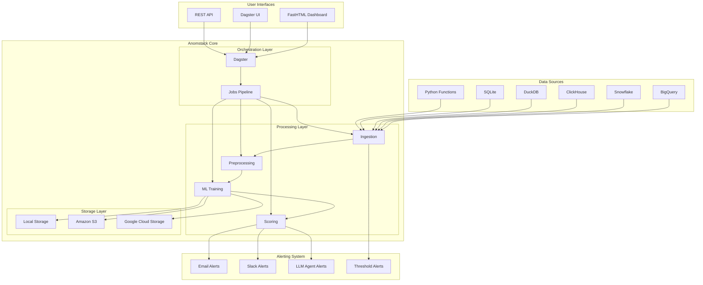

# Introduction to Anomstack

Anomstack is an open-source anomaly detection platform that makes it easy to monitor and detect anomalies in your metrics data. Built on top of [Dagster](https://dagster.io/) for orchestration and [FastHTML](https://fastht.ml/) + [MonsterUI](https://github.com/AnswerDotAI/MonsterUI) for the dashboard, Anomstack provides a complete solution for metric monitoring and anomaly detection.

## Key Features

- 🔍 **Powerful Anomaly Detection**: Built on [PyOD](https://pyod.readthedocs.io/en/latest/) for robust anomaly detection
- 📊 **Beautiful Dashboard**: Modern UI for visualizing metrics and anomalies
- 🔌 **Multiple Data Sources**: Support for various databases and data platforms
- 🔔 **Flexible Alerting**: Email and Slack notifications with customizable templates
- 🤖 **LLM Agent Integration**: AI-powered anomaly analysis and reporting
- 🛠️ **Easy Deployment**: Multiple deployment options including Docker, Dagster Cloud, and more

## How It Works

1. **Define Your Metrics**: Configure your metrics using SQL queries or Python functions
2. **Automatic Processing**: Anomstack handles ingestion, training, scoring, and alerting
3. **Monitor & Alert**: Get notified when anomalies are detected
4. **Visualize**: Use the dashboard to explore metrics and anomalies

## Supported Data Sources

Anomstack supports a wide range of data sources:

- Python (direct integration)
- BigQuery
- Snowflake
- ClickHouse
- DuckDB
- SQLite
- MotherDuck
- Turso
- Redshift (coming soon)

## Storage Options

Store your trained models and configurations in:

- Local filesystem
- Google Cloud Storage (GCS)
- Amazon S3
- Azure Blob Storage (coming soon)

## Getting Started

Choose your preferred way to get started:

- [Quickstart Guide](quickstart)
- [Docker Deployment](deployment/docker)
- [GCP Deployment](deployment/gcp)

## Architecture

Anomstack is built with a modular architecture that separates concerns across multiple layers:

### Key Components

- **Data Sources**: Connect to multiple databases and platforms
- **Orchestration**: Dagster manages the entire pipeline workflow  
- **Processing**: ML-powered anomaly detection using PyOD
- **Storage**: Flexible model and data storage options
- **Interfaces**: Multiple ways to interact with the system
- **Alerting**: Multi-channel notification system with AI-powered insights

## Contributing

We welcome contributions! Check out our [Contributing Guide](https://github.com/andrewm4894/anomstack/blob/main/CONTRIBUTING.md) to get started.

## License

Anomstack is open source and available under the [MIT License](https://github.com/andrewm4894/anomstack/blob/main/LICENSE).
